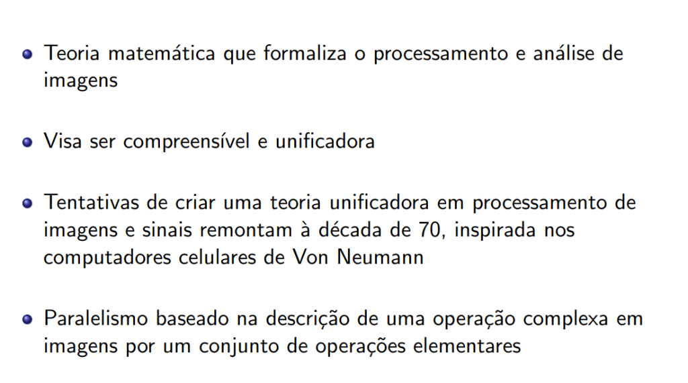
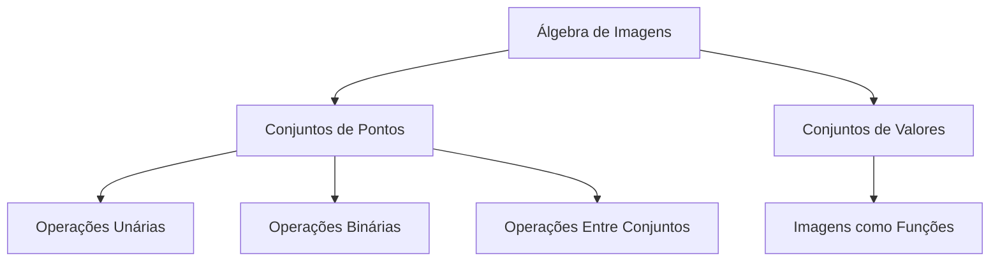

# Introdução à Álgebra de Imagens

## O que é Álgebra de Imagens?

A **Álgebra de Imagens** é uma teoria matemática que formaliza o processamento e análise de imagens. Visa ser **compreensível** e **unificadora**.

---

## Contexto Histórico

- Tentativas de criar uma teoria unificadora em processamento de imagens e sinais remontam à **década de 70**
- Inspirada nos **computadores celulares de Von Neumann**
- Surgiu da necessidade da **força aérea americana**: algoritmos independentes de linguagem

---

## Conceito Fundamental

O paralelismo é baseado na descrição de uma **operação complexa** em imagens por um **conjunto de operações elementares**.

### Componentes

- **Aritmética de vizinhança** + **Morfologia matemática**
- Elementos básicos: **imagens** + **templates** + **vizinhanças**

---

## Estrutura da Álgebra de Imagens

!!! note "Lembre-se"
    Uma álgebra é uma coleção de conjuntos não vazios mais um número finito de operações que combinam elementos formando novos.

### Características

- A Álgebra de Imagens é **heterogênea** (sentido de Birkhoff) pois contém elementos de tipos diferentes

### Dois Elementos Básicos

| Elemento | Descrição |
|----------|-----------|
| **Conjuntos de Pontos** | *Pixels* e sua relação espacial |
| **Conjuntos de Valores** | Intensidade, cor, etc. dos *pixels* |

!!! info "Observação"
    Possivelmente mais de um valor por ponto.

---

## Visão Geral dos Próximos Tópicos

