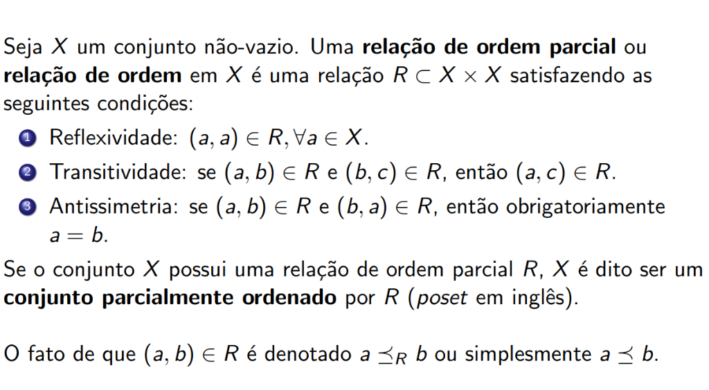
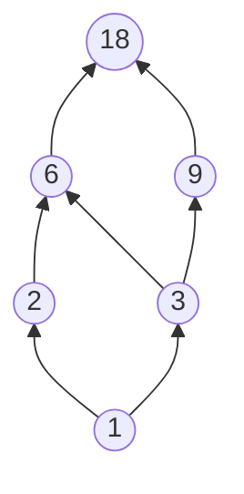
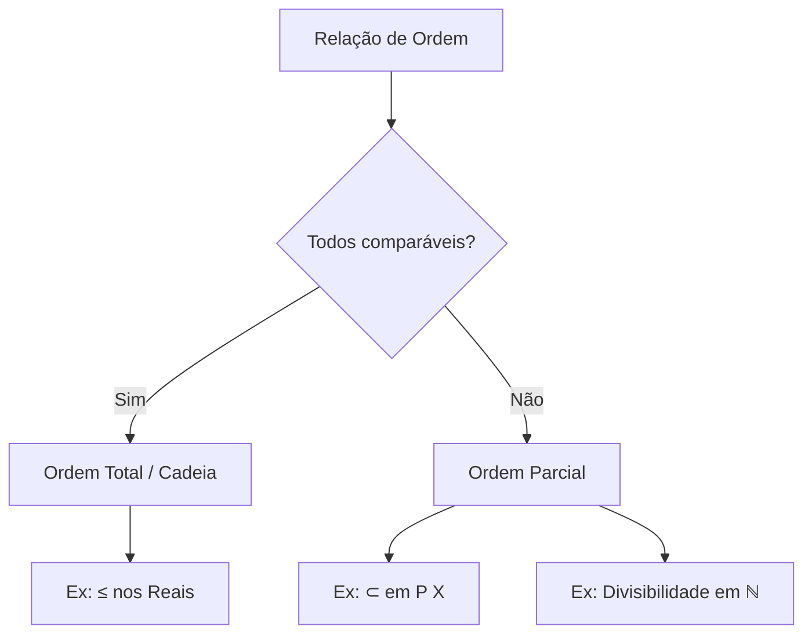

# Estruturas Algébricas

## Relação de Ordem Parcial

Seja \( X \) um conjunto não-vazio. Uma **relação de ordem parcial** ou **relação de ordem** em \( X \) é uma relação \( R \subset X \times X \) satisfazendo as seguintes condições:

1. **Reflexividade**: \( (a, a) \in R, \forall a \in X \)
2. **Transitividade**: se \( (a, b) \in R \) e \( (b, c) \in R \), então \( (a, c) \in R \)
3. **Antissimetria**: se \( (a, b) \in R \) e \( (b, a) \in R \), então obrigatoriamente \( a = b \)

!!! info "Conjunto Parcialmente Ordenado (Poset)"
    Se o conjunto \( X \) possui uma relação de ordem parcial \( R \), \( X \) é dito ser um **conjunto parcialmente ordenado** por \( R \) (*poset* em inglês).

O fato de que \( (a, b) \in R \) é denotado \( a \preceq_R b \) ou simplesmente \( a \preceq b \).

---

## Exemplos e Contra-Exemplos

### Exemplos de Ordem Parcial

!!! example "Exemplo 1: Conjunto das Partes"
    Seja \( X \) um conjunto e \( \mathbb{P}(X) \) a coleção de todos os seus subconjuntos. Então para quaisquer \( A, B \subset X \) podemos estabelecer a relação de ordem \( R \) tal que \( A \preceq_R B \), i.e., \( (A, B) \in R \), se \( A \subset B \).

!!! example "Exemplo 2: Ordem Total nos Reais"
    Ordem clássica "menor ou igual" nos reais (este é um caso especial em que todos os elementos são "comparáveis" entre si, o que se chama de **ordem total** ou **cadeia**).

!!! example "Exemplo 3: Divisibilidade nos Naturais"
    Relação \( a \preceq b \) se \( a \) divide \( b \) nos naturais.

### Contra-Exemplos

!!! warning "Contra-Exemplo 1: Ordem Estrita"
    Ordem "estritamente menor" nos reais **não é reflexiva**, pois não temos \( a < a \).

!!! warning "Contra-Exemplo 2: Divisibilidade nos Inteiros"
    Divisibilidade nos inteiros **não é antissimétrica**, pois \( -a \) divide \( a \) e \( a \) divide \( -a \), mesmo que \( a \neq -a \).

---

## Ordem Total vs Ordem Parcial

| Propriedade | Ordem Parcial | Ordem Total |
|-------------|---------------|-------------|
| Reflexividade | ✅ | ✅ |
| Transitividade | ✅ | ✅ |
| Antissimetria | ✅ | ✅ |
| Comparabilidade | ❌ Nem todos comparáveis | ✅ Todos comparáveis |

!!! note "Ordem Total (Cadeia)"
    Uma ordem é **total** quando para quaisquer \( a, b \in X \), temos \( a \preceq b \) ou \( b \preceq a \). Ou seja, todos os elementos são comparáveis entre si.

---

## Máximo e Mínimo

### Definição de Máximo

Se \( X \) é um conjunto dotado de uma relação de ordem parcial \( \preceq \), diz-se que \( z \in X \) é o **máximo** de \( X \) se:

\[
x \preceq z, \forall x \in X
\]

Se tal máximo existir, ele será **único**.

### Definição de Mínimo

Se \( X \) é um conjunto dotado de uma relação de ordem parcial \( \preceq \), diz-se que \( a \in X \) é o **mínimo** de \( X \) se:

\[
a \preceq x, \forall x \in X
\]

Se tal mínimo existir, ele será **único**.

### Exemplos

!!! success "Exemplo: Divisores de 18"
    Conjunto \( D_{18} = \{1, 2, 3, 6, 9, 18\} \) de todos os números que dividem 18:
    
    - **Máximo**: 18 (todos dividem 18)
    - **Mínimo**: 1 (1 divide todos)

!!! failure "Contra-Exemplo: Conjunto sem Máximo nem Mínimo"
    Conjunto \( \{2, 3, 6, 12, 18\} \) com relação de divisibilidade **não tem nem máximo nem mínimo**:
    
    - 2 não divide 3 e 3 não divide 2 (não comparáveis)
    - 18 não é dividido por 12, apenas por 2, 3 e 6

---

## Majorantes, Minorantes, Supremo e Ínfimo

### Majorante (Limitante Superior)

Seja \( X \) um conjunto dotado da ordem \( \preceq \) e \( A \subset X \). Se existe um elemento \( t \in X \) tal que:

\[
a \preceq t, \forall a \in A
\]

Então diz-se que \( t \) é um **majorante** ou **limitante superior** de \( A \).

### Minorante (Limitante Inferior)

Analogamente, se existe um elemento \( h \in X \) tal que:

\[
h \preceq a, \forall a \in A
\]

Então diz-se que \( h \) é um **minorante** ou **limitante inferior** de \( A \).

### Supremo e Ínfimo

!!! abstract "Supremo (Menor Majorante)"
    O **mínimo** do conjunto de majorantes de \( A \), se existir, é chamado de **supremo** de \( A \).
    
    \[
    \sup(A) = \min\{t \in X : a \preceq t, \forall a \in A\}
    \]

!!! abstract "Ínfimo (Maior Minorante)"
    O **máximo** do conjunto de minorantes de \( A \), se existir, é chamado de **ínfimo** de \( A \).
    
    \[
    \inf(A) = \max\{h \in X : h \preceq a, \forall a \in A\}
    \]

### Exemplos

!!! example "Exemplo: Intervalo Aberto (0, 1) em ℝ"
    Subconjunto aberto \( (0, 1) \) de \( \mathbb{R} \) com relação \( \leq \):
    
    - **Majorantes**: qualquer \( x \geq 1 \)
    - **Minorantes**: qualquer \( x \leq 0 \)
    - **Supremo**: 1
    - **Ínfimo**: 0
    
    Note que o supremo e o ínfimo **não pertencem** ao conjunto \( (0, 1) \)!

!!! example "Exemplo: Divisores de 36"
    Seja \( D_{36} = \{1, 2, 3, 4, 6, 9, 12, 18, 36\} \) e o subconjunto \( A = \{2, 3\} \):
    
    - **Majorantes de A**: 6, 12, 18, 36 (múltiplos comuns)
    - **Supremo**: 6 (menor majorante = MMC)
    - **Minorante de A**: 1 (divide ambos)
    - **Ínfimo**: 1 (maior minorante = MDC)

### Relação entre Máximo/Mínimo e Supremo/Ínfimo

| Conceito | Pertence ao conjunto? | Existência |
|----------|----------------------|------------|
| Máximo | ✅ Sim, obrigatoriamente | Pode não existir |
| Mínimo | ✅ Sim, obrigatoriamente | Pode não existir |
| Supremo | ❓ Não necessariamente | Pode não existir |
| Ínfimo | ❓ Não necessariamente | Pode não existir |

!!! tip "Dica Importante"
    Se o **máximo** de um conjunto existe, então ele é igual ao **supremo**.  
    Se o **mínimo** de um conjunto existe, então ele é igual ao **ínfimo**.

---

## Diagrama de Hasse

Uma forma visual de representar relações de ordem parcial é através do **Diagrama de Hasse**:

*Diagrama de Hasse para os divisores de 18 com relação de divisibilidade.*

---

## Reticulados (Lattices)

### Definição

Um **reticulado** é uma estrutura \( (L, \preceq) \) em que \( L \) é um conjunto parcialmente ordenado e \( \preceq \) uma relação de ordem parcial tal que para quaisquer \( a, b \in L \) o conjunto \( \{a, b\} \) possui **supremo e ínfimo**.

### Exemplos de Reticulados

!!! example "Exemplo 1: Conjunto das Partes"
    Conjunto de subconjuntos de \( X \) ordenado pela relação "subconjunto de". Para qualquer par de conjuntos:
    
    - **Supremo**: dado pela **união** \( A \cup B \)
    - **Ínfimo**: dado pela **intersecção** \( A \cap B \)

!!! example "Exemplo 2: Inteiros Positivos com ≤"
    Inteiros positivos com relação usual \( \leq \):
    
    - **Supremo**: \( \max\{a, b\} \)
    - **Ínfimo**: \( \min\{a, b\} \)

!!! example "Exemplo 3: Divisores com Divisibilidade"
    \( \{1, 2, 3, 6\} \) ordenado por divisibilidade:
    
    - **Supremo de \( \{a, b\} \)**: mínimo múltiplo comum (MMC)
    - **Ínfimo de \( \{a, b\} \)**: máximo divisor comum (MDC)

### Contra-Exemplos

!!! failure "Contra-Exemplo 1"
    Conjunto \( \{1, 2, 3\} \) com divisibilidade **não é reticulado**, pois \( \{2, 3\} \) não possui sequer majorantes (não existe elemento que seja divisível por 2 e por 3 no conjunto).

!!! failure "Contra-Exemplo 2"
    \( \{1, 2, 3, 12, 18, 36\} \) por divisibilidade **não é reticulado**:
    
    - O par \( \{2, 3\} \) possui os majorantes \( \{12, 18, 36\} \), mas 12 e 18 não são comparáveis, então **não há supremo**
    - Similarmente, o par \( \{12, 18\} \) tem os minorantes \( \{1, 2, 3\} \) mas **não tem ínfimo**

---

### Reticulado Limitado

!!! note "Limitado Superiormente"
    Um reticulado é dito ser **limitado superiormente** se possuir um **máximo**, isto é, um elemento \( \omega \in C \) tal que:
    \[
    x \preceq \omega, \forall x \in C
    \]

!!! note "Limitado Inferiormente"
    Um reticulado é dito ser **limitado inferiormente** se possuir um **mínimo**, isto é, um elemento \( \alpha \in C \) tal que:
    \[
    \alpha \preceq x, \forall x \in C
    \]

### Reticulado Completo

!!! abstract "Definição"
    Um **reticulado completo** é aquele em que todo subconjunto seu não-vazio possui um supremo e um ínfimo em relação à ordem \( \preceq \).

---

### Diagramas de Hasse de Reticulados

A representação visual amplamente usada é o **Diagrama de Hasse**. Nos exemplos abaixo, os dois primeiros são reticulados (relações "subconjunto de" e "divide").

!!! success "Reticulados (1º e 2º diagramas)"
    - **Conjunto das partes de {x, y, z}**: Todo par tem sup (união) e inf (intersecção)
    - **Divisores de 60**: Todo par tem sup (MMC) e inf (MDC)

!!! failure "Não-Reticulados (3º e 4º diagramas)"
    - **3º diagrama**: O par \( \{c, d\} \) não possui sequer majorante, muito menos supremo
    - **4º diagrama**: O par \( \{b, c\} \) possui majorantes \( d, e, f \) mas não um supremo único

### Tabela Resumo de Reticulados

| Tipo | Condição |
|------|----------|
| **Reticulado** | Todo par \( \{a, b\} \) tem sup e inf |
| **Limitado Superiormente** | Possui máximo (elemento maior que todos) |
| **Limitado Inferiormente** | Possui mínimo (elemento menor que todos) |
| **Limitado** | Possui máximo e mínimo |
| **Completo** | Todo subconjunto não-vazio tem sup e inf |

---

## Resumo

