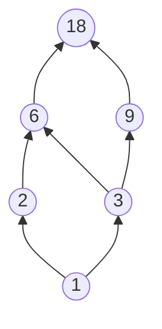
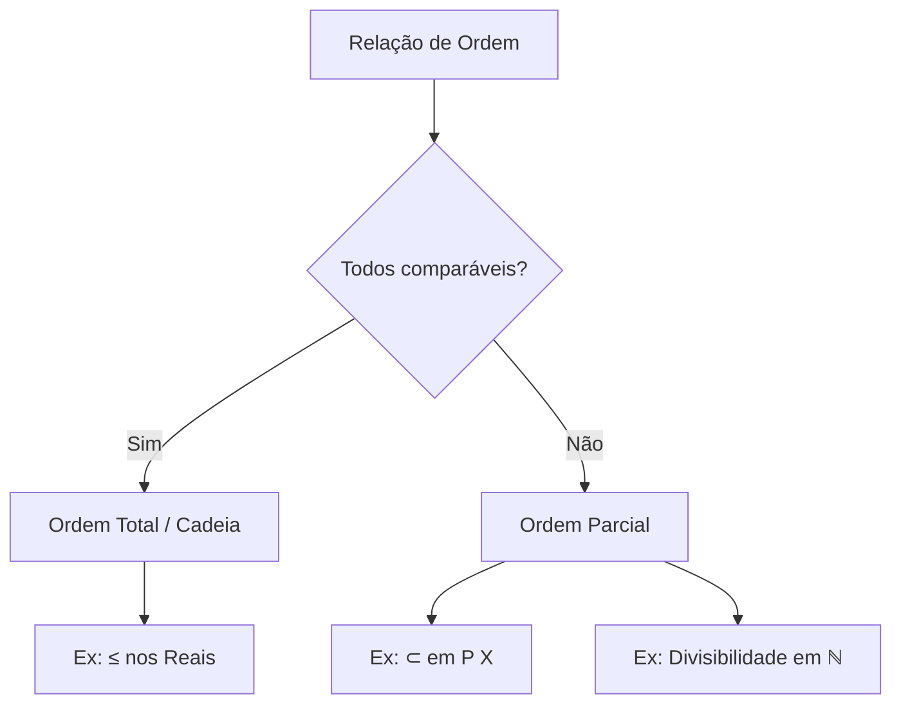

# Ordem Parcial e Total

## Relação de Ordem Parcial

Seja \( X \) um conjunto não-vazio. Uma **relação de ordem parcial** ou **relação de ordem** em \( X \) é uma relação \( R \subset X \times X \) satisfazendo as seguintes condições:

1. **Reflexividade**: \( (a, a) \in R, \forall a \in X \)
2. **Transitividade**: se \( (a, b) \in R \) e \( (b, c) \in R \), então \( (a, c) \in R \)
3. **Antissimetria**: se \( (a, b) \in R \) e \( (b, a) \in R \), então obrigatoriamente \( a = b \)

!!! info "Conjunto Parcialmente Ordenado (Poset)"
    Se o conjunto \( X \) possui uma relação de ordem parcial \( R \), \( X \) é dito ser um **conjunto parcialmente ordenado** por \( R \) (*poset* em inglês).

O fato de que \( (a, b) \in R \) é denotado \( a \preceq_R b \) ou simplesmente \( a \preceq b \).

---

## Exemplos de Ordem Parcial

!!! example "Exemplo 1: Conjunto das Partes"
    Seja \( X \) um conjunto e \( \mathbb{P}(X) \) a coleção de todos os seus subconjuntos. Então para quaisquer \( A, B \subset X \) podemos estabelecer a relação de ordem \( R \) tal que \( A \preceq_R B \), i.e., \( (A, B) \in R \), se \( A \subset B \).

!!! example "Exemplo 2: Ordem Total nos Reais"
    Ordem clássica "menor ou igual" nos reais (este é um caso especial em que todos os elementos são "comparáveis" entre si, o que se chama de **ordem total** ou **cadeia**).

!!! example "Exemplo 3: Divisibilidade nos Naturais"
    Relação \( a \preceq b \) se \( a \) divide \( b \) nos naturais.

---

## Contra-Exemplos

!!! warning "Contra-Exemplo 1: Ordem Estrita"
    Ordem "estritamente menor" nos reais **não é reflexiva**, pois não temos \( a < a \).

!!! warning "Contra-Exemplo 2: Divisibilidade nos Inteiros"
    Divisibilidade nos inteiros **não é antissimétrica**, pois \( -a \) divide \( a \) e \( a \) divide \( -a \), mesmo que \( a \neq -a \).

---

## Ordem Total vs Ordem Parcial

| Propriedade | Ordem Parcial | Ordem Total |
|-------------|---------------|-------------|
| Reflexividade | ✅ | ✅ |
| Transitividade | ✅ | ✅ |
| Antissimetria | ✅ | ✅ |
| Comparabilidade | ❌ Nem todos comparáveis | ✅ Todos comparáveis |

!!! note "Ordem Total (Cadeia)"
    Uma ordem é **total** quando para quaisquer \( a, b \in X \), temos \( a \preceq b \) ou \( b \preceq a \). Ou seja, todos os elementos são comparáveis entre si.

---

## Diagrama de Hasse

Uma forma visual de representar relações de ordem parcial é através do **Diagrama de Hasse**:

*Diagrama de Hasse para os divisores de 18 com relação de divisibilidade.*

---

## Resumo

