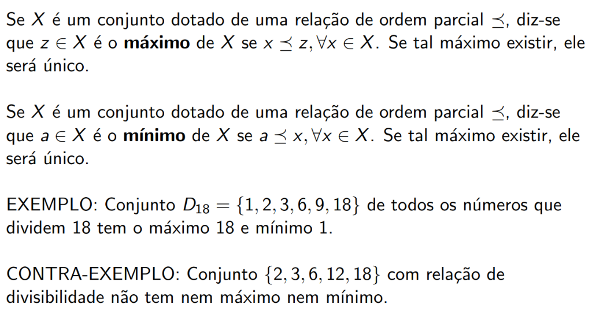
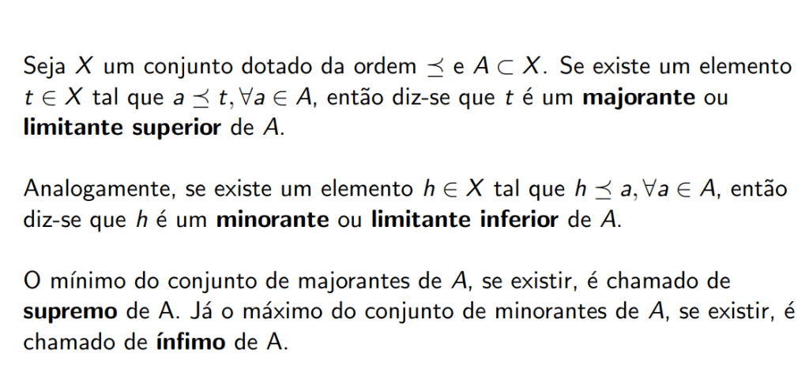
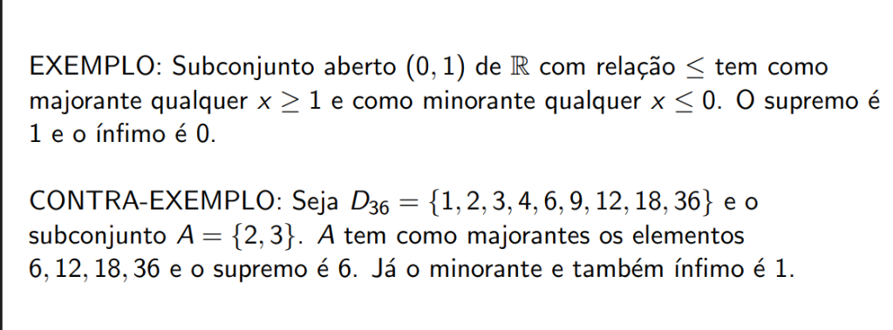

# Máximo, Mínimo, Supremo e Ínfimo

## Máximo e Mínimo

### Definição de Máximo

Se \( X \) é um conjunto dotado de uma relação de ordem parcial \( \preceq \), diz-se que \( z \in X \) é o **máximo** de \( X \) se:

\[
x \preceq z, \forall x \in X
\]

Se tal máximo existir, ele será **único**.

### Definição de Mínimo

Se \( X \) é um conjunto dotado de uma relação de ordem parcial \( \preceq \), diz-se que \( a \in X \) é o **mínimo** de \( X \) se:

\[
a \preceq x, \forall x \in X
\]

Se tal mínimo existir, ele será **único**.

### Exemplos

!!! success "Exemplo: Divisores de 18"
    Conjunto \( D_{18} = \{1, 2, 3, 6, 9, 18\} \) de todos os números que dividem 18:
    
    - **Máximo**: 18 (todos dividem 18)
    - **Mínimo**: 1 (1 divide todos)

!!! failure "Contra-Exemplo: Conjunto sem Máximo nem Mínimo"
    Conjunto \( \{2, 3, 6, 12, 18\} \) com relação de divisibilidade **não tem nem máximo nem mínimo**:
    
    - 2 não divide 3 e 3 não divide 2 (não comparáveis)
    - 18 não é dividido por 12, apenas por 2, 3 e 6

---

## Majorantes e Minorantes

### Majorante (Limitante Superior)

Seja \( X \) um conjunto dotado da ordem \( \preceq \) e \( A \subset X \). Se existe um elemento \( t \in X \) tal que:

\[
a \preceq t, \forall a \in A
\]

Então diz-se que \( t \) é um **majorante** ou **limitante superior** de \( A \).

### Minorante (Limitante Inferior)

Analogamente, se existe um elemento \( h \in X \) tal que:

\[
h \preceq a, \forall a \in A
\]

Então diz-se que \( h \) é um **minorante** ou **limitante inferior** de \( A \).

---

## Supremo e Ínfimo

!!! abstract "Supremo (Menor Majorante)"
    O **mínimo** do conjunto de majorantes de \( A \), se existir, é chamado de **supremo** de \( A \).
    
    \[
    \sup(A) = \min\{t \in X : a \preceq t, \forall a \in A\}
    \]

!!! abstract "Ínfimo (Maior Minorante)"
    O **máximo** do conjunto de minorantes de \( A \), se existir, é chamado de **ínfimo** de \( A \).
    
    \[
    \inf(A) = \max\{h \in X : h \preceq a, \forall a \in A\}
    \]

---

## Exemplos de Supremo e Ínfimo

!!! example "Exemplo: Intervalo Aberto (0, 1) em ℝ"
    Subconjunto aberto \( (0, 1) \) de \( \mathbb{R} \) com relação \( \leq \):
    
    - **Majorantes**: qualquer \( x \geq 1 \)
    - **Minorantes**: qualquer \( x \leq 0 \)
    - **Supremo**: 1
    - **Ínfimo**: 0
    
    Note que o supremo e o ínfimo **não pertencem** ao conjunto \( (0, 1) \)!

!!! example "Exemplo: Divisores de 36"
    Seja \( D_{36} = \{1, 2, 3, 4, 6, 9, 12, 18, 36\} \) e o subconjunto \( A = \{2, 3\} \):
    
    - **Majorantes de A**: 6, 12, 18, 36 (múltiplos comuns)
    - **Supremo**: 6 (menor majorante = MMC)
    - **Minorante de A**: 1 (divide ambos)
    - **Ínfimo**: 1 (maior minorante = MDC)

---

## Comparação: Máximo/Mínimo vs Supremo/Ínfimo

| Conceito | Pertence ao conjunto? | Existência |
|----------|----------------------|------------|
| Máximo | ✅ Sim, obrigatoriamente | Pode não existir |
| Mínimo | ✅ Sim, obrigatoriamente | Pode não existir |
| Supremo | ❓ Não necessariamente | Pode não existir |
| Ínfimo | ❓ Não necessariamente | Pode não existir |

!!! tip "Dica Importante"
    Se o **máximo** de um conjunto existe, então ele é igual ao **supremo**.  
    Se o **mínimo** de um conjunto existe, então ele é igual ao **ínfimo**.
