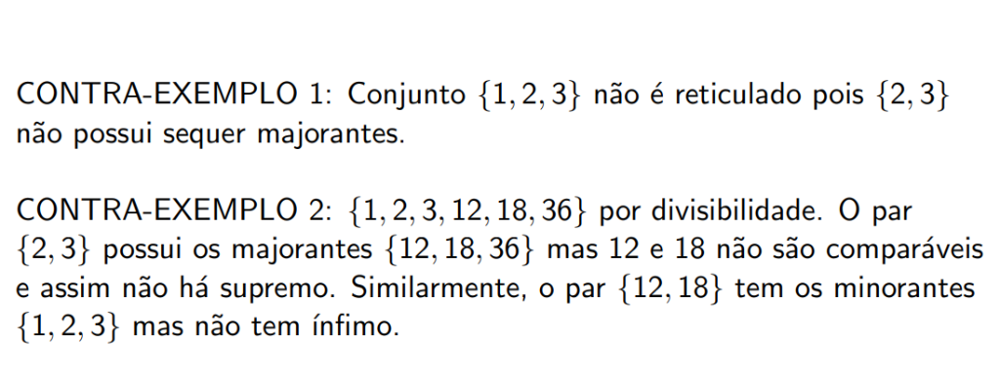
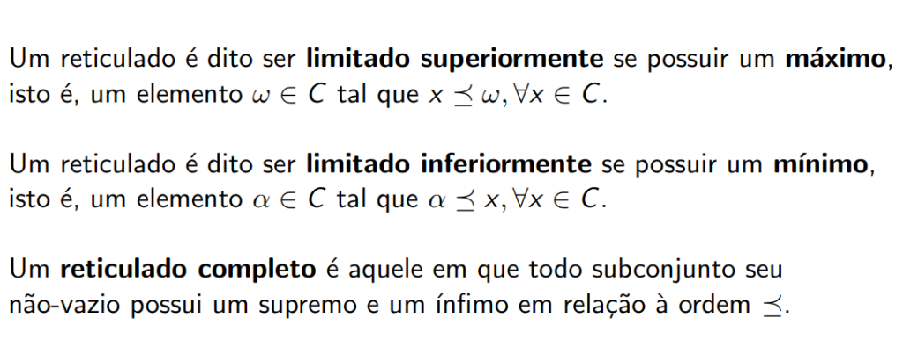

# Reticulados (Lattices)

## Definição

Um **reticulado** é uma estrutura \( (L, \preceq) \) em que \( L \) é um conjunto parcialmente ordenado e \( \preceq \) uma relação de ordem parcial tal que para quaisquer \( a, b \in L \) o conjunto \( \{a, b\} \) possui **supremo e ínfimo**.

---

## Exemplos de Reticulados

!!! example "Exemplo 1: Conjunto das Partes"
    Conjunto de subconjuntos de \( X \) ordenado pela relação "subconjunto de". Para qualquer par de conjuntos:
    
    - **Supremo**: dado pela **união** \( A \cup B \)
    - **Ínfimo**: dado pela **intersecção** \( A \cap B \)

!!! example "Exemplo 2: Inteiros Positivos com ≤"
    Inteiros positivos com relação usual \( \leq \):
    
    - **Supremo**: \( \max\{a, b\} \)
    - **Ínfimo**: \( \min\{a, b\} \)

!!! example "Exemplo 3: Divisores com Divisibilidade"
    \( \{1, 2, 3, 6\} \) ordenado por divisibilidade:
    
    - **Supremo de \( \{a, b\} \)**: mínimo múltiplo comum (MMC)
    - **Ínfimo de \( \{a, b\} \)**: máximo divisor comum (MDC)

---

## Contra-Exemplos

!!! failure "Contra-Exemplo 1"
    Conjunto \( \{1, 2, 3\} \) com divisibilidade **não é reticulado**, pois \( \{2, 3\} \) não possui sequer majorantes (não existe elemento que seja divisível por 2 e por 3 no conjunto).

!!! failure "Contra-Exemplo 2"
    \( \{1, 2, 3, 12, 18, 36\} \) por divisibilidade **não é reticulado**:
    
    - O par \( \{2, 3\} \) possui os majorantes \( \{12, 18, 36\} \), mas 12 e 18 não são comparáveis, então **não há supremo**
    - Similarmente, o par \( \{12, 18\} \) tem os minorantes \( \{1, 2, 3\} \) mas **não tem ínfimo**

---

## Reticulado Limitado

!!! note "Limitado Superiormente"
    Um reticulado é dito ser **limitado superiormente** se possuir um **máximo**, isto é, um elemento \( \omega \in C \) tal que:
    \[
    x \preceq \omega, \forall x \in C
    \]

!!! note "Limitado Inferiormente"
    Um reticulado é dito ser **limitado inferiormente** se possuir um **mínimo**, isto é, um elemento \( \alpha \in C \) tal que:
    \[
    \alpha \preceq x, \forall x \in C
    \]

---

## Reticulado Completo

!!! abstract "Definição"
    Um **reticulado completo** é aquele em que todo subconjunto seu não-vazio possui um supremo e um ínfimo em relação à ordem \( \preceq \).

---

## Diagramas de Hasse de Reticulados

A representação visual amplamente usada é o **Diagrama de Hasse**. Nos exemplos abaixo, os dois primeiros são reticulados (relações "subconjunto de" e "divide").

!!! success "Reticulados (1º e 2º diagramas)"
    - **Conjunto das partes de {x, y, z}**: Todo par tem sup (união) e inf (intersecção)
    - **Divisores de 60**: Todo par tem sup (MMC) e inf (MDC)

!!! failure "Não-Reticulados (3º e 4º diagramas)"
    - **3º diagrama**: O par \( \{c, d\} \) não possui sequer majorante, muito menos supremo
    - **4º diagrama**: O par \( \{b, c\} \) possui majorantes \( d, e, f \) mas não um supremo único

---

## Tabela Resumo

| Tipo | Condição |
|------|----------|
| **Reticulado** | Todo par \( \{a, b\} \) tem sup e inf |
| **Limitado Superiormente** | Possui máximo (elemento maior que todos) |
| **Limitado Inferiormente** | Possui mínimo (elemento menor que todos) |
| **Limitado** | Possui máximo e mínimo |
| **Completo** | Todo subconjunto não-vazio tem sup e inf |
