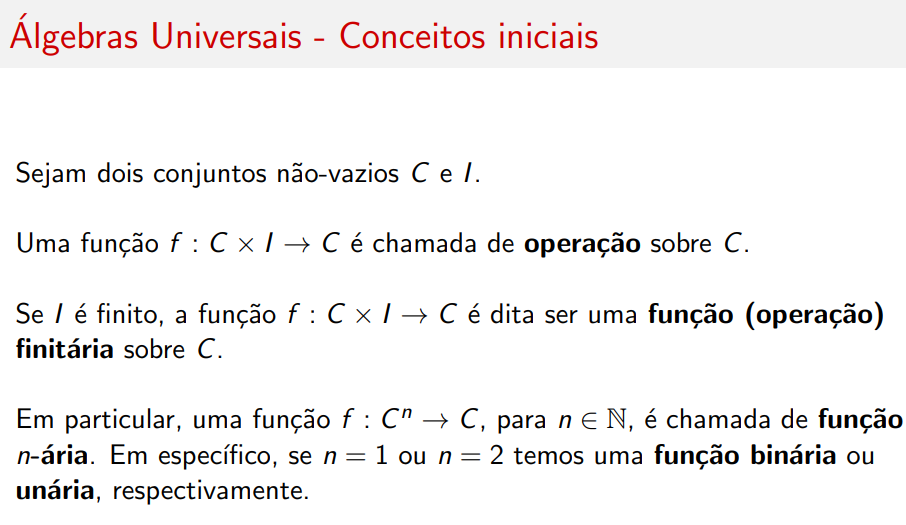
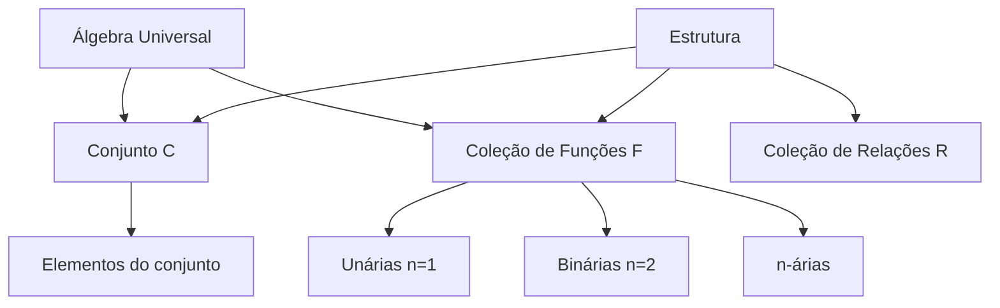

# Álgebra Universal

## Conceitos Iniciais

Sejam dois conjuntos não-vazios \( C \) e \( I \).

### Operação

Uma função \( f : C \times I \rightarrow C \) é chamada de **operação** sobre \( C \).

### Operação Finitária

Se \( I \) é finito, a função \( f : C \times I \rightarrow C \) é dita ser uma **função (operação) finitária** sobre \( C \).

### Função n-ária

Em particular, uma função \( f : C^n \rightarrow C \), para \( n \in \mathbb{N} \), é chamada de **função n-ária**:

| n | Nome | Exemplo |
|---|------|---------|
| 1 | **Unária** | Negação, complemento |
| 2 | **Binária** | Soma, multiplicação |
| 3 | **Ternária** | \( t(A, B, C) = AB^TC \) |

---

## Relações e Estruturas

### Relação

Um subconjunto \( R \subset C \times I \) é chamado de **relação** sobre \( C \).

Se \( R \subset C^n \), temos uma **relação n-ária**.

### Estrutura

Seja \( C \) um conjunto, \( \mathfrak{F} \) uma coleção de operações sobre \( C \) e \( \mathfrak{R} \) uma coleção de relações sobre \( C \).

A tripla \( \langle C, \mathfrak{F}, \mathfrak{R} \rangle \) é chamada de **estrutura** sobre \( C \).

---

## Definição de Álgebra Universal

!!! abstract "Definição Formal"
    Uma **álgebra universal** é composta por um conjunto \( C \) e uma coleção \( \mathfrak{F} \) (não necessariamente finita) de funções **finitárias** sobre \( C \).
    
    Representa-se por \( \langle C, \mathfrak{F} \rangle \).

---

## Exemplos de Álgebras Universais

### Exemplo 1: Números Reais

\[
C = \mathbb{R}, \quad \mathfrak{F} = \{s, m\}
\]

Onde \( s \) e \( m \) são funções **binárias** definidas por:

- \( s : \mathbb{R}^2 \rightarrow \mathbb{R}, \quad s(x, y) = x + y \) (soma)
- \( m : \mathbb{R}^2 \rightarrow \mathbb{R}, \quad m(x, y) = x \cdot y \) (multiplicação)

---

### Exemplo 2: Matrizes Quadradas

\[
C = Mat(\mathbb{C}, n) \text{ (conjunto das matrizes complexas de ordem } n \times n, n \in \mathbb{N})
\]

\[
\mathfrak{F} = \{s, m\}
\]

Onde:

- \( s : C^2 \rightarrow C, \quad s(A, B) = A + B \) (soma de matrizes)
- \( m : C^2 \rightarrow C, \quad m(A, B) = A \cdot B \) (multiplicação de matrizes)

---

### Exemplo 3: Matrizes Retangulares

\[
C = Mat(\mathbb{C}, m, n) \text{ (conjunto das matrizes complexas de ordem } m \times n, m, n \in \mathbb{N})
\]

\[
\mathfrak{F} = \{c, s, t\}
\]

Onde:

| Função | Aridade | Definição |
|--------|---------|-----------|
| \( c \) | Unária | \( c : C \rightarrow C, \quad c(A) = \overline{A} \) (matriz complexo-conjugada) |
| \( s \) | Binária | \( s : C^2 \rightarrow C, \quad s(A, B) = A + B \) |
| \( t \) | Ternária | \( t : C^3 \rightarrow C, \quad t(A, B, C) = AB^TC \) |

!!! note "Notação"
    \( B^T \) denota a transposta de \( B \).

---

## Resumo

