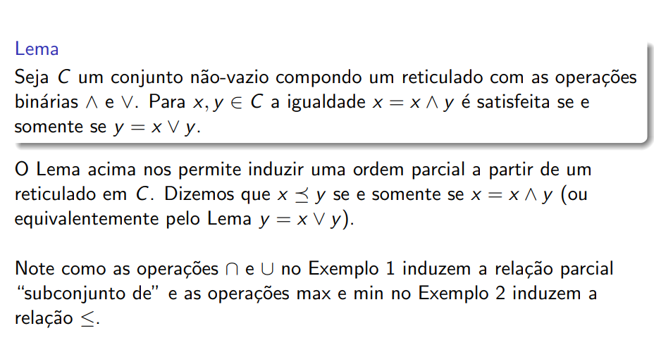
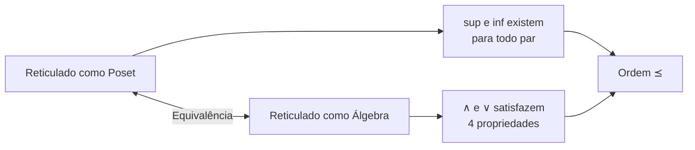

# Reticulados como Estruturas Algébricas

## Visão Algébrica de Reticulados

Um **reticulado** pode também ser visto como uma **álgebra universal** composta por um conjunto não-vazio \( C \) e duas funções binárias \( \wedge \) e \( \vee \) (lê-se "e" e "ou", respectivamente).

!!! info "Notação"
    Usamos **notação mesofixa** (infixo): escrevemos \( a \wedge b \) em vez de \( \wedge(a, b) \).

---

## Propriedades Fundamentais

Para quaisquer \( a, b, c \in C \), as operações \( \wedge \) e \( \vee \) devem satisfazer:

### 1. Idempotência

\[
a \wedge a = a \qquad a \vee a = a
\]

### 2. Comutatividade

\[
a \wedge b = b \wedge a \qquad a \vee b = b \vee a
\]

### 3. Associatividade

\[
a \wedge (b \wedge c) = (a \wedge b) \wedge c \qquad a \vee (b \vee c) = (a \vee b) \vee c
\]

### 4. Absorvência (Amalgamento)

\[
a \wedge (a \vee b) = a \qquad a \vee (a \wedge b) = a
\]

---

## Tabela Resumo das Propriedades

| Propriedade | Operação \( \wedge \) | Operação \( \vee \) |
|-------------|----------------------|---------------------|
| **Idempotência** | \( a \wedge a = a \) | \( a \vee a = a \) |
| **Comutatividade** | \( a \wedge b = b \wedge a \) | \( a \vee b = b \vee a \) |
| **Associatividade** | \( a \wedge (b \wedge c) = (a \wedge b) \wedge c \) | \( a \vee (b \vee c) = (a \vee b) \vee c \) |
| **Absorvência** | \( a \wedge (a \vee b) = a \) | \( a \vee (a \wedge b) = a \) |

---

## Exemplos

### Exemplo 1: Conjunto das Partes

Seja \( C = \mathbb{P}(B) \), para algum conjunto não-vazio \( B \).

Para todo \( a, b \subset B \), definimos:

- \( a \wedge b := a \cap b \) (intersecção)
- \( a \vee b := a \cup b \) (união)

!!! success "Verificação"
    As operações de intersecção e união satisfazem todas as 4 propriedades, formando um reticulado.

### Exemplo 2: Números Reais

Seja \( C = \mathbb{R} \) e as seguintes funções binárias:

- \( a \wedge b := \min\{a, b\} \)
- \( a \vee b := \max\{a, b\} \)

!!! success "Verificação"
    As operações min e max também satisfazem as 4 propriedades.

---

## Lema: Relação entre Operações e Ordem

!!! abstract "Lema"
    Seja \( C \) um conjunto não-vazio compondo um reticulado com as operações binárias \( \wedge \) e \( \vee \).
    
    Para \( x, y \in C \), a igualdade \( x = x \wedge y \) é satisfeita **se e somente se** \( y = x \vee y \).

### Induzindo uma Ordem Parcial

O Lema acima nos permite **induzir uma ordem parcial** a partir de um reticulado em \( C \).

Dizemos que:

\[
x \preceq y \quad \text{se e somente se} \quad x = x \wedge y
\]

Ou equivalentemente (pelo Lema):

\[
x \preceq y \quad \text{se e somente se} \quad y = x \vee y
\]

---

## Conexão entre as Duas Visões

!!! tip "Importante"
    - No **Exemplo 1**: as operações \( \cap \) e \( \cup \) induzem a relação parcial "subconjunto de" (\( \subset \))
    - No **Exemplo 2**: as operações \( \min \) e \( \max \) induzem a relação \( \leq \)

---

## Resumo

| Perspectiva | Definição |
|-------------|-----------|
| **Poset** | Conjunto parcialmente ordenado onde todo par tem sup e inf |
| **Álgebra Universal** | \( \langle C, \wedge, \vee \rangle \) satisfazendo idempotência, comutatividade, associatividade e absorvência |

As duas definições são **equivalentes** - podemos transitar entre elas livremente.
