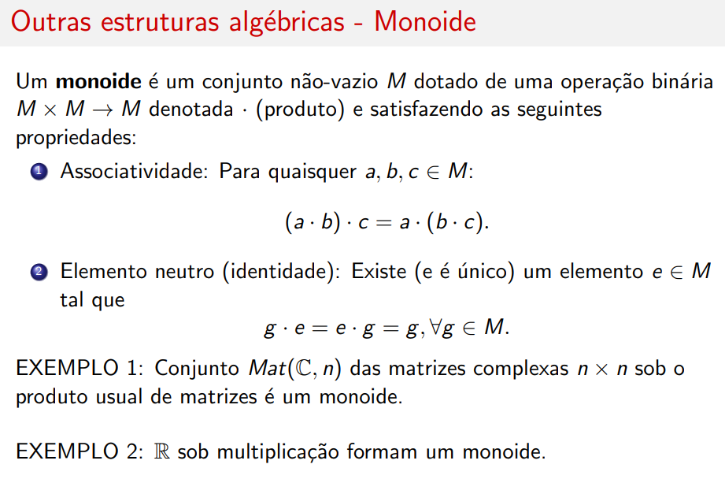
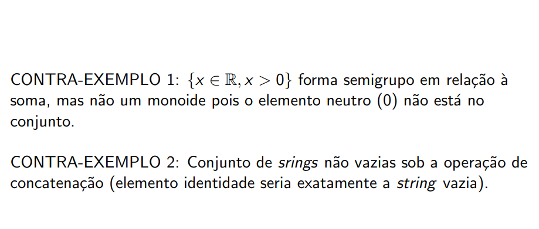
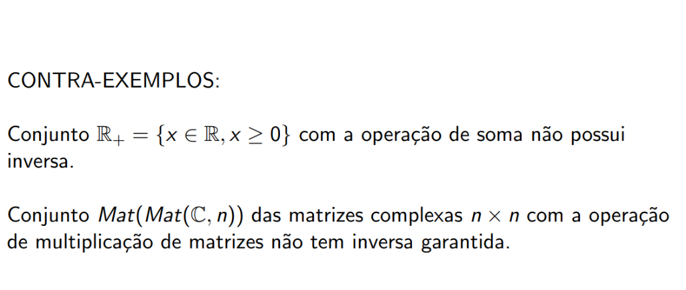
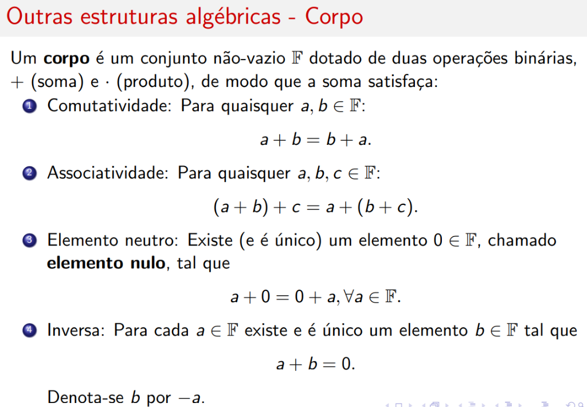
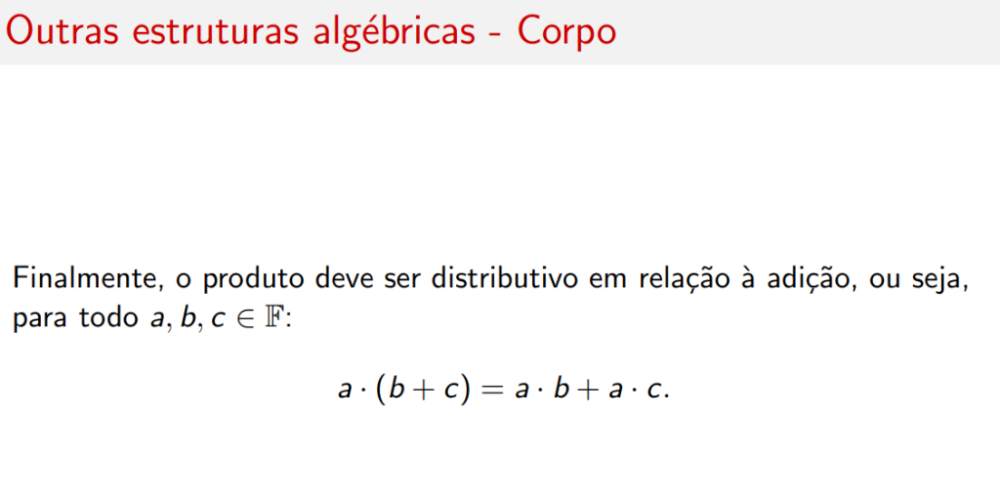
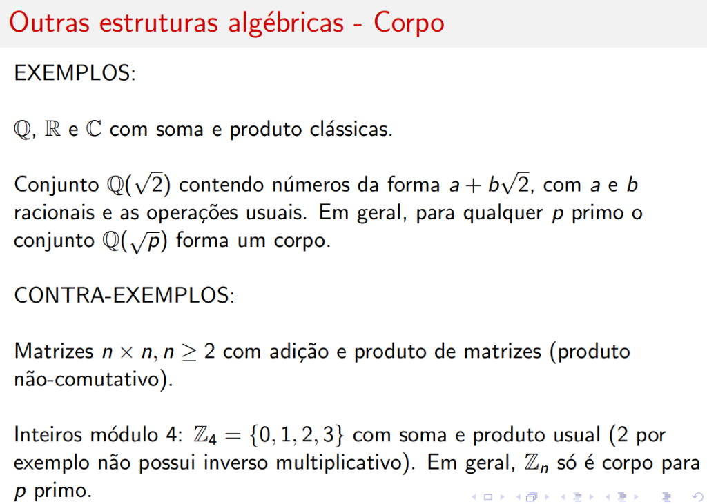
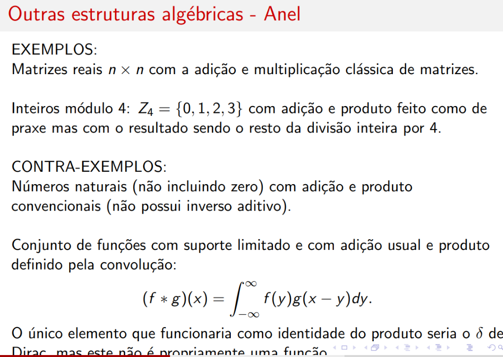
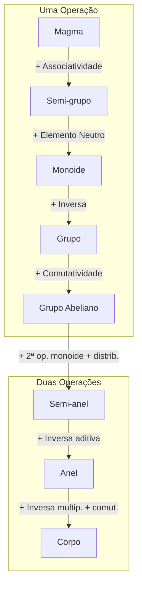

# Outras Estruturas Algébricas

Esta seção apresenta uma hierarquia de estruturas algébricas, partindo da mais simples (Magma) até a mais rica (Grupo).

---

## Magma (Grupoide)

Um **magma** (ou **grupoide**) é um conjunto não-vazio \( N \) dotado de uma operação binária \( N \times N \rightarrow N \) denotada \( \cdot \) (produto) e satisfazendo a seguinte propriedade:

### Fechamento

Para quaisquer \( a, b \in N \):

\[
(a \cdot b) \in N
\]

### Exemplos

!!! example "Exemplo 1"
    Soma nos reais: \( (\mathbb{R}, +) \)

!!! example "Exemplo 2"
    Multiplicação de matrizes reais

### Contra-Exemplos

!!! failure "Contra-Exemplo 1"
    Soma nos reais **excluindo o zero**: \( a + (-a) = 0 \), mas \( 0 \) não está no conjunto.

!!! failure "Contra-Exemplo 2"
    Conjunto de funções complexas com produto interno em um intervalo fechado (resultado é um número, não uma função).

!!! info "Importante"
    Todas as estruturas a seguir satisfazem o fechamento.

---

## Semi-grupo

Um **semi-grupo** é um conjunto não-vazio \( S \) dotado de uma operação binária \( S \times S \rightarrow S \) denotada \( \cdot \) (produto) e satisfazendo:

### Associatividade

Para quaisquer \( a, b, c \in S \):

\[
(a \cdot b) \cdot c = a \cdot (b \cdot c)
\]

### Exemplos

!!! example "Exemplo 1"
    Conjunto dos naturais positivos \( \{1, 2, 3, \ldots\} \) formam semi-grupo na operação de soma.

!!! example "Exemplo 2"
    Multiplicação de matrizes reais.

### Contra-Exemplos

!!! failure "Contra-Exemplo 1"
    Reais com operação de subtração \( - \):
    \[
    (a - b) - c \neq a - (b - c)
    \]

!!! failure "Contra-Exemplo 2"
    Reais com operação média \( a \oplus b = \frac{a + b}{2} \) (não é associativa).

---

## Monoide

Um **monoide** é um conjunto não-vazio \( M \) dotado de uma operação binária \( M \times M \rightarrow M \) denotada \( \cdot \) (produto) e satisfazendo:

### 1. Associatividade

Para quaisquer \( a, b, c \in M \):

\[
(a \cdot b) \cdot c = a \cdot (b \cdot c)
\]

### 2. Elemento Neutro (Identidade)

Existe (e é único) um elemento \( e \in M \) tal que:

\[
g \cdot e = e \cdot g = g, \quad \forall g \in M
\]

### Exemplos

!!! example "Exemplo 1"
    Conjunto \( Mat(\mathbb{C}, n) \) das matrizes complexas \( n \times n \) sob o produto usual de matrizes é um monoide (identidade = matriz identidade \( I \)).

!!! example "Exemplo 2"
    \( \mathbb{R} \) sob multiplicação formam um monoide (identidade = 1).

### Contra-Exemplos

!!! failure "Contra-Exemplo 1"
    \( \{x \in \mathbb{R} : x > 0\} \) forma semigrupo em relação à soma, mas **não um monoide** pois o elemento neutro (0) não está no conjunto.

!!! failure "Contra-Exemplo 2"
    Conjunto de strings **não vazias** sob a operação de concatenação (elemento identidade seria exatamente a string vazia).

---

## Grupo

Um **grupo** é um conjunto não-vazio \( G \) dotado de uma operação binária \( G \times G \rightarrow G \) denotada \( \cdot \) (produto) e uma operação unária \( G \rightarrow G \) denotada \( ^{-1} \) (inversa) e satisfazendo:

### 1. Associatividade

Para quaisquer \( a, b, c \in G \):

\[
(a \cdot b) \cdot c = a \cdot (b \cdot c)
\]

### 2. Elemento Neutro

Existe (e é único) um elemento \( e \in G \) tal que:

\[
g \cdot e = e \cdot g = g, \quad \forall g \in G
\]

### 3. Inversa

Para cada \( g \in G \) existe e é único um elemento \( h \in G \) tal que:

\[
g \cdot h = h \cdot g = e
\]

\( h \) é chamado de **inversa** de \( g \) e denotado \( g^{-1} \).

!!! note "Grupo Abeliano"
    Se o grupo também satisfizer a **comutatividade** (\( a \cdot b = b \cdot a \)), é chamado de **abeliano**.

### Exemplos de Grupos

!!! example "Grupos Abelianos com Soma"
    Conjuntos \( \mathbb{Z}, \mathbb{Q}, \mathbb{R} \) e \( \mathbb{C} \) são grupos abelianos em relação à soma usual.
    
    Tais grupos costumam ser denotados respectivamente \( (\mathbb{Z}, +), (\mathbb{Q}, +), (\mathbb{R}, +) \) e \( (\mathbb{C}, +) \).

!!! example "Grupos Abelianos com Multiplicação"
    Conjuntos \( \mathbb{Q}\setminus\{0\}, \mathbb{R}\setminus\{0\} \) e \( \mathbb{C}\setminus\{0\} \) são grupos abelianos em relação à multiplicação usual.
    
    Denotados respectivamente \( (\mathbb{Q}, \cdot), (\mathbb{R}, \cdot) \) e \( (\mathbb{C}, \cdot) \).

!!! example "Grupo Não-Abeliano"
    Conjunto \( GL(\mathbb{R}, n) \) de todas as matrizes reais \( n \times n, n > 1 \) com determinante não-nulo (inversíveis) formam um **grupo não-abeliano**.

### Contra-Exemplos de Grupos

!!! failure "Contra-Exemplo 1"
    Conjunto \( \mathbb{R}_+ = \{x \in \mathbb{R} : x \geq 0\} \) com a operação de soma **não possui inversa** (não existe \( -a \) para \( a > 0 \) no conjunto).

!!! failure "Contra-Exemplo 2"
    Conjunto \( Mat(\mathbb{C}, n) \) das matrizes complexas \( n \times n \) com a operação de multiplicação de matrizes **não tem inversa garantida** (matrizes singulares não têm inversa).

---

## Corpo (Field)

Um **corpo** é um conjunto não-vazio \( \mathbb{F} \) dotado de **duas operações binárias**, \( + \) (soma) e \( \cdot \) (produto), satisfazendo as propriedades abaixo.

### Propriedades da Soma

1. **Comutatividade**: Para quaisquer \( a, b \in \mathbb{F} \):
\[
a + b = b + a
\]

2. **Associatividade**: Para quaisquer \( a, b, c \in \mathbb{F} \):
\[
(a + b) + c = a + (b + c)
\]

3. **Elemento Neutro (Zero)**: Existe (e é único) um elemento \( 0 \in \mathbb{F} \), chamado **elemento nulo**, tal que:
\[
a + 0 = 0 + a = a, \quad \forall a \in \mathbb{F}
\]

4. **Inversa Aditiva**: Para cada \( a \in \mathbb{F} \) existe e é único um elemento \( b \in \mathbb{F} \) tal que:
\[
a + b = 0
\]
Denota-se \( b \) por \( -a \).

### Propriedades do Produto

1. **Comutatividade**: Para quaisquer \( a, b \in \mathbb{F} \):
\[
a \cdot b = b \cdot a
\]

2. **Associatividade**: Para quaisquer \( a, b, c \in \mathbb{F} \):
\[
(a \cdot b) \cdot c = a \cdot (b \cdot c)
\]

3. **Elemento Neutro (Unidade)**: Existe (e é único) um elemento \( 1 \in \mathbb{F} \), chamado **unidade**, tal que:
\[
a \cdot 1 = 1 \cdot a = a, \quad \forall a \in \mathbb{F}
\]

4. **Inversa Multiplicativa**: Para cada \( a \in \mathbb{F}, a \neq 0 \) existe e é único um elemento \( b \in \mathbb{F} \) tal que:
\[
a \cdot b = 1
\]
Denota-se \( b \) por \( a^{-1} \).

### Distributividade

Finalmente, o produto deve ser **distributivo** em relação à adição:

\[
a \cdot (b + c) = a \cdot b + a \cdot c, \quad \forall a, b, c \in \mathbb{F}
\]

### Exemplos de Corpos

!!! success "Exemplos"
    - \( \mathbb{Q}, \mathbb{R} \) e \( \mathbb{C} \) com soma e produto clássicas
    - Conjunto \( \mathbb{Q}(\sqrt{2}) \) contendo números da forma \( a + b\sqrt{2} \), com \( a \) e \( b \) racionais
    - Em geral, para qualquer \( p \) primo o conjunto \( \mathbb{Q}(\sqrt{p}) \) forma um corpo

!!! failure "Contra-Exemplos"
    - Matrizes \( n \times n, n \geq 2 \) com adição e produto de matrizes (produto **não-comutativo**)
    - Inteiros módulo 4: \( \mathbb{Z}_4 = \{0, 1, 2, 3\} \) com soma e produto usual (2 não possui inverso multiplicativo)
    - Em geral, \( \mathbb{Z}_n \) só é corpo para \( p \) **primo**

---

## Anel (Ring)

Um **anel** é um conjunto não-vazio \( A \) dotado de duas operações binárias, \( + \) (soma) e \( \cdot \) (produto), de modo que a soma satisfaça os mesmos requisitos de um corpo.

### Propriedades da Soma

1. **Comutatividade**: \( a + b = b + a \)
2. **Associatividade**: \( (a + b) + c = a + (b + c) \)
3. **Elemento Neutro (Zero)**: Existe \( 0 \in A \) tal que \( a + 0 = 0 + a = a \)
4. **Inversa Aditiva**: Para cada \( a \) existe \( -a \) tal que \( a + (-a) = 0 \)

### Propriedades do Produto

O produto se comporta como um **monoide** (não precisa ser comutativo nem ter inversa):

1. **Associatividade**: \( (a \cdot b) \cdot c = a \cdot (b \cdot c) \)
2. **Elemento Neutro (Unidade)**: Existe \( 1 \in A \) tal que \( a \cdot 1 = 1 \cdot a = a \)
3. **Distributividade**: \( a \cdot (b + c) = a \cdot b + a \cdot c \)

### Exemplos e Contra-Exemplos de Anéis

!!! example "Exemplos"
    - Matrizes reais \( n \times n \) com adição e multiplicação clássica de matrizes
    - Inteiros módulo 4: \( \mathbb{Z}_4 = \{0, 1, 2, 3\} \) com adição e produto feito como de praxe mas com o resultado sendo o resto da divisão inteira por 4

!!! failure "Contra-Exemplos"
    - Números naturais (não incluindo zero) com adição e produto convencionais (**não possui inverso aditivo**)
    - Conjunto de funções com suporte limitado e com adição usual e produto definido pela convolução:
    \[
    (f * g)(x) = \int_{-\infty}^{\infty} f(y)g(x - y)dy
    \]
    O único elemento que funcionaria como identidade do produto seria o \( \delta \) de Dirac, mas este não é propriamente uma função.

---

## Semi-anel (Semiring)

Um **semi-anel** é idêntico a um anel exceto pelo fato de que **não se exige a definição de uma inversa aditiva**.

### Exemplos de Semi-anéis

!!! example "Exemplos Básicos"
    - Todo anel é por definição também um semi-anel
    - Conjunto dos naturais (incluindo 0), bem como dos reais não-negativos e racionais não-negativos, sob as operações clássicas de adição e multiplicação

!!! example "Matrizes Não-Negativas"
    Matrizes \( n \times n \) com entradas não negativas sob as operações convencionais de adição e multiplicação de matrizes (não necessariamente comutativo).

!!! example "Linguagens Formais"
    Em linguagens formais, denotamos um alfabeto de símbolos por \( \Sigma \) e o conjunto de palavras possíveis por \( \Sigma^* \).
    
    Um exemplo de semi-anel é uma **linguagem formal** (subconjunto de \( \Sigma^* \)) dotada de:
    
    - **Produto**: definido pela concatenação de strings
    - **Adição**: definida pela união dos conjuntos de cada linguagem

---

## Hierarquia das Estruturas

---

## Tabela Comparativa

### Estruturas com Uma Operação

| Estrutura | Fecham. | Assoc. | Neutro | Inversa | Comut. |
|-----------|:-------:|:------:|:------:|:-------:|:------:|
| **Magma** | ✅ | ❌ | ❌ | ❌ | ❌ |
| **Semi-grupo** | ✅ | ✅ | ❌ | ❌ | ❌ |
| **Monoide** | ✅ | ✅ | ✅ | ❌ | ❌ |
| **Grupo** | ✅ | ✅ | ✅ | ✅ | ❌ |
| **Grupo Abeliano** | ✅ | ✅ | ✅ | ✅ | ✅ |

### Estruturas com Duas Operações

| Estrutura | Soma: Grupo Abel. | Produto: Monoide | Prod. Comut. | Inv. Multip. | Distrib. |
|-----------|:-----------------:|:----------------:|:------------:|:------------:|:--------:|
| **Semi-anel** | ❌ (só monoide) | ✅ | ❌ | ❌ | ✅ |
| **Anel** | ✅ | ✅ | ❌ | ❌ | ✅ |
| **Corpo** | ✅ | ✅ | ✅ | ✅ | ✅ |
