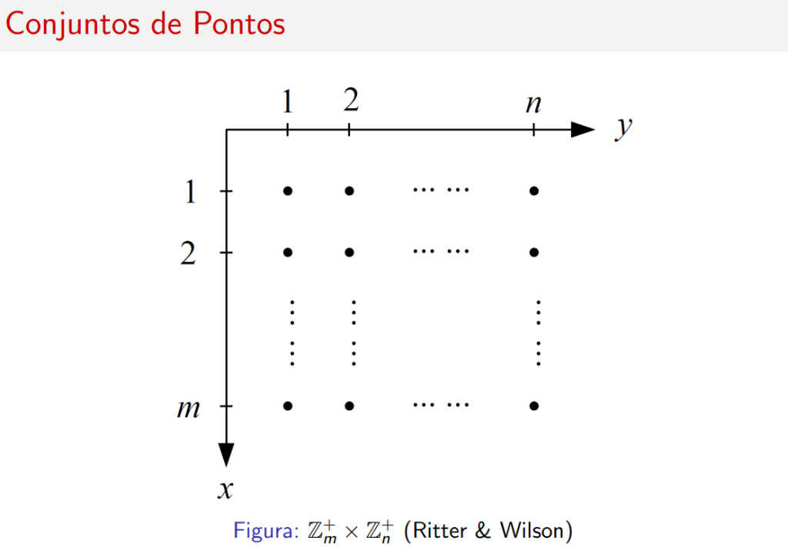

# Conjuntos de Pontos

## Definição

**Conjuntos de pontos** são espaços topológicos compostos por:

- **Conjuntos de objetos**: *pontos*
- **Topologia**: *conectividade*

A **conectividade** define proximidade, vizinhança, curva, etc.

---

## Notação

### Conjuntos de Pontos

Conjuntos de pontos são denotados pelas **últimas letras maiúsculas do alfabeto em negrito**:

\[
\mathbf{X}, \mathbf{Y}, \mathbf{W}, \mathbf{Z}
\]

### Pontos (Elementos)

Pontos (elementos) são denotados com as **últimas letras minúsculas**:

\[
\mathbf{x}, \mathbf{y}, \mathbf{w}, \mathbf{z} \in \mathbf{X}
\]

### Coordenadas

Se \( \mathbf{x} \in \mathbb{R}^n \), representa-se:

\[
\mathbf{x} = (x_1, x_2, \ldots, x_n)
\]

onde \( x_i \) é um número real chamado **i-ésima coordenada** de \( \mathbf{x} \).

---

## Conjuntos de Pontos Usuais

Os conjuntos de pontos mais usuais em álgebra de imagens são **subconjuntos discretos** do espaço Euclideano \( \mathbb{R}^n \) com \( n = 1, 2, 3 \).

### Arranjos Espaciais

Podem estar organizados em qualquer arranjo espacial, embora formas **retangulares**, **circulares** ou ***snake*** sejam mais comuns.

### Conjuntos Retangulares

Dois dos conjuntos que mais veremos são os **retangulares**:

!!! note "Indexação começando em 0"
    \[
    \mathbf{X} = \mathbb{Z}_m \times \mathbb{Z}_n = \{(x_1, x_2) \in \mathbb{Z}^2 : 0 \leq x_1 \leq m-1, 0 \leq x_2 \leq n-1\}
    \]

!!! note "Indexação começando em 1"
    \[
    \mathbf{X} = \mathbb{Z}_m^+ \times \mathbb{Z}_n^+ = \{(x_1, x_2) \in \mathbb{Z}^2 : 1 \leq x_1 \leq m, 1 \leq x_2 \leq n\}
    \]

---

## Representação Visual

A figura acima mostra a representação de \( \mathbb{Z}_m^+ \times \mathbb{Z}_n^+ \), onde:

- O eixo **x** (vertical) representa as linhas de 1 a \( m \)
- O eixo **y** (horizontal) representa as colunas de 1 a \( n \)

---

## Resumo

| Notação | Significado |
|---------|-------------|
| \( \mathbf{X}, \mathbf{Y}, \mathbf{W}, \mathbf{Z} \) | Conjuntos de pontos |
| \( \mathbf{x}, \mathbf{y}, \mathbf{w}, \mathbf{z} \) | Pontos (elementos) |
| \( \mathbb{Z}_m \times \mathbb{Z}_n \) | Conjunto retangular (índice 0) |
| \( \mathbb{Z}_m^+ \times \mathbb{Z}_n^+ \) | Conjunto retangular (índice 1) |
