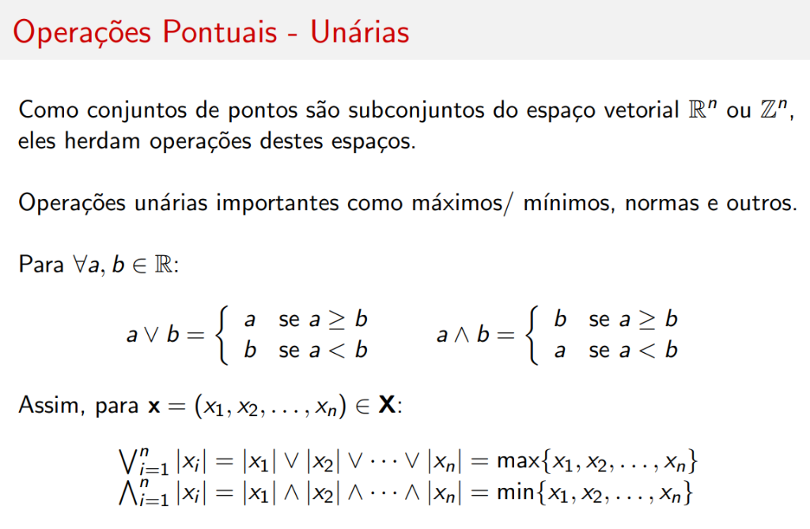
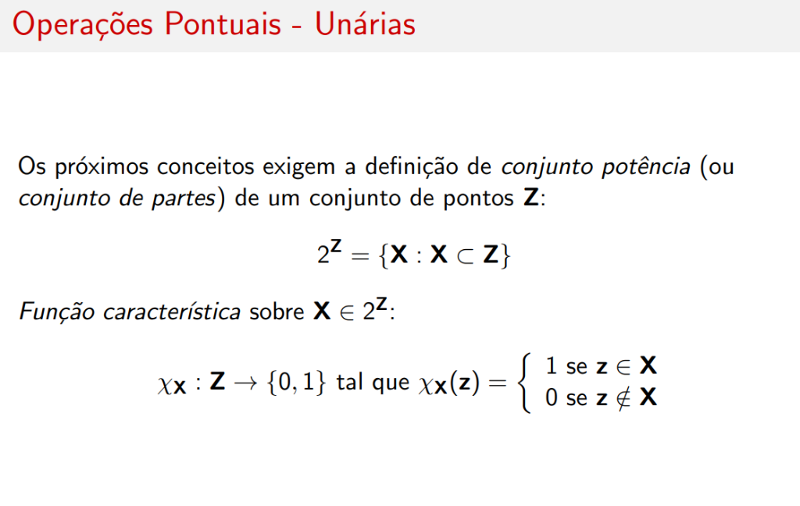
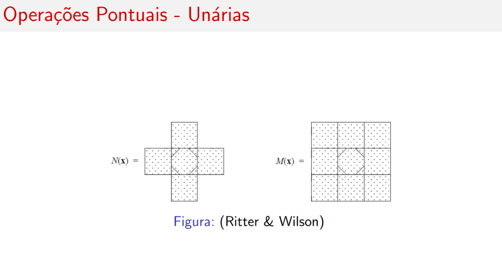
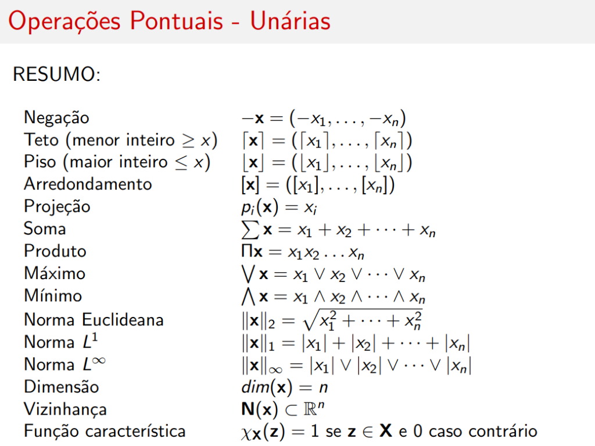

# Operações Unárias

## Introdução

Como conjuntos de pontos são subconjuntos do espaço vetorial \( \mathbb{R}^n \) ou \( \mathbb{Z}^n \), eles **herdam operações** destes espaços.

Operações unárias importantes incluem **máximos/mínimos**, **normas** e outros.

---

## Máximo e Mínimo

Para \( \forall a, b \in \mathbb{R} \):

### Máximo (\( \vee \))

\[
a \vee b = \begin{cases} a & \text{se } a \geq b \\ b & \text{se } a < b \end{cases}
\]

### Mínimo (\( \wedge \))

\[
a \wedge b = \begin{cases} b & \text{se } a \geq b \\ a & \text{se } a < b \end{cases}
\]

### Extensão para Vetores

Para \( \mathbf{x} = (x_1, x_2, \ldots, x_n) \in \mathbf{X} \):

\[
\bigvee_{i=1}^{n} |x_i| = |x_1| \vee |x_2| \vee \cdots \vee |x_n| = \max\{x_1, x_2, \ldots, x_n\}
\]

\[
\bigwedge_{i=1}^{n} |x_i| = |x_1| \wedge |x_2| \wedge \cdots \wedge |x_n| = \min\{x_1, x_2, \ldots, x_n\}
\]

---

## Normas

Tratando o ponto como vetor, definimos as normas:

### Norma Euclideana (\( L^2 \))

\[
\|\mathbf{x}\|_2 = \sqrt{x_1^2 + \cdots + x_n^2}
\]

### Norma \( L^p \)

\[
\|\mathbf{x}\|_p = \left( \sum_{i=1}^{n} |x_i|^p \right)^{1/p}
\]

### Norma \( L^\infty \)

\[
\|\mathbf{x}\|_\infty = \bigvee_{i=1}^{n} |x_i| = \max\{|x_1|, \ldots, |x_n|\}
\]

### Projeção

Outra operação unária (\( \mathbf{X} \rightarrow \mathbb{R} \)) importante é a **i-ésima projeção** de \( \mathbf{X} \subset \mathbb{R}^n \), \( i = 1, \ldots, n \):

\[
p_i(\mathbf{x}) = x_i
\]

---

## Conjunto Potência e Função Característica

Os próximos conceitos exigem a definição de **conjunto potência** (ou **conjunto de partes**) de um conjunto de pontos \( \mathbf{Z} \):

\[
2^{\mathbf{Z}} = \{\mathbf{X} : \mathbf{X} \subset \mathbf{Z}\}
\]

### Função Característica

**Função característica** sobre \( \mathbf{X} \in 2^{\mathbf{Z}} \):

\[
\chi_{\mathbf{X}} : \mathbf{Z} \rightarrow \{0, 1\} \text{ tal que } \chi_{\mathbf{X}}(\mathbf{z}) = \begin{cases} 1 & \text{se } \mathbf{z} \in \mathbf{X} \\ 0 & \text{se } \mathbf{z} \notin \mathbf{X} \end{cases}
\]

---

## Função de Vizinhança

Dados dois conjuntos de pontos \( \mathbf{X} \) e \( \mathbf{Z} \), definimos a **função de vizinhança** de \( \mathbf{X} \) para \( \mathbf{Z} \) por:

\[
N(\mathbf{x}) : \mathbf{X} \rightarrow 2^{\mathbf{Z}}
\]

\( N(\mathbf{x}) \) é a vizinhança de \( \mathbf{x} \) e em \( \mathbb{Z}^2 \) pode ser definida de duas formas:

### Vizinhança de von Neumann (\( N(\mathbf{x}) \))

\[
N(\mathbf{x}) = \{\mathbf{y} : \mathbf{y} = (x_1 \pm j, x_2) \text{ ou } \mathbf{y} = (x_1, x_2 \pm k), j, k \in \{0, 1\}\}
\]

### Vizinhança de Moore (\( M(\mathbf{x}) \))

\[
M(\mathbf{x}) = \{\mathbf{y} : \mathbf{y} = (x_1 \pm j, x_2 \pm k), j, k \in \{0, 1\}\}
\]

---

## Representação Visual das Vizinhanças

| Vizinhança | Forma | Conectividade |
|------------|-------|---------------|
| **von Neumann** \( N(\mathbf{x}) \) | Cruz (+) | 4-conectado |
| **Moore** \( M(\mathbf{x}) \) | Quadrado 3×3 | 8-conectado |

---

## Resumo Completo

| Operação | Definição |
|----------|-----------|
| **Negação** | \( -\mathbf{x} = (-x_1, \ldots, -x_n) \) |
| **Teto** (menor inteiro \( \geq x \)) | \( \lceil \mathbf{x} \rceil = (\lceil x_1 \rceil, \ldots, \lceil x_n \rceil) \) |
| **Piso** (maior inteiro \( \leq x \)) | \( \lfloor \mathbf{x} \rfloor = (\lfloor x_1 \rfloor, \ldots, \lfloor x_n \rfloor) \) |
| **Arredondamento** | \( [\mathbf{x}] = ([x_1], \ldots, [x_n]) \) |
| **Projeção** | \( p_i(\mathbf{x}) = x_i \) |
| **Soma** | \( \sum \mathbf{x} = x_1 + x_2 + \cdots + x_n \) |
| **Produto** | \( \Pi \mathbf{x} = x_1 x_2 \ldots x_n \) |
| **Máximo** | \( \bigvee \mathbf{x} = x_1 \vee x_2 \vee \cdots \vee x_n \) |
| **Mínimo** | \( \bigwedge \mathbf{x} = x_1 \wedge x_2 \wedge \cdots \wedge x_n \) |
| **Norma Euclideana** | \( \|\mathbf{x}\|_2 = \sqrt{x_1^2 + \cdots + x_n^2} \) |
| **Norma \( L^1 \)** | \( \|\mathbf{x}\|_1 = |x_1| + |x_2| + \cdots + |x_n| \) |
| **Norma \( L^\infty \)** | \( \|\mathbf{x}\|_\infty = |x_1| \vee |x_2| \vee \cdots \vee |x_n| \) |
| **Dimensão** | \( dim(\mathbf{x}) = n \) |
| **Vizinhança** | \( \mathbf{N}(\mathbf{x}) \subset \mathbb{R}^n \) |
| **Função característica** | \( \chi_{\mathbf{X}}(\mathbf{z}) = 1 \) se \( \mathbf{z} \in \mathbf{X} \) e 0 caso contrário |

---

## Exemplos Práticos

Dado \( \mathbf{x} = (2, 1, 3) \):

| Operação | Cálculo | Resultado |
|----------|---------|-----------|
| Negação | \( -\mathbf{x} \) | \( (-2, -1, -3) \) |
| Projeção \( p_1 \) | \( p_1(\mathbf{x}) \) | \( 2 \) |
| Projeção \( p_2 \) | \( p_2(\mathbf{x}) \) | \( 1 \) |
| Projeção \( p_3 \) | \( p_3(\mathbf{x}) \) | \( 3 \) |
| Soma | \( \sum \mathbf{x} = 2 + 1 + 3 \) | \( 6 \) |
| Produto | \( \Pi \mathbf{x} = 2 \cdot 1 \cdot 3 \) | \( 6 \) |
| Máximo | \( \bigvee \mathbf{x} = 2 \vee 1 \vee 3 \) | \( 3 \) |
| Mínimo | \( \bigwedge \mathbf{x} = 2 \wedge 1 \wedge 3 \) | \( 1 \) |
| Norma \( L^2 \) | \( \sqrt{2^2 + 1^2 + 3^2} \) | \( \sqrt{14} \) |
| Norma \( L^1 \) | \( |2| + |1| + |3| \) | \( 6 \) |
| Norma \( L^\infty \) | \( |2| \vee |1| \vee |3| \) | \( 3 \) |
| Dimensão | \( dim(\mathbf{x}) \) | \( 3 \) |

