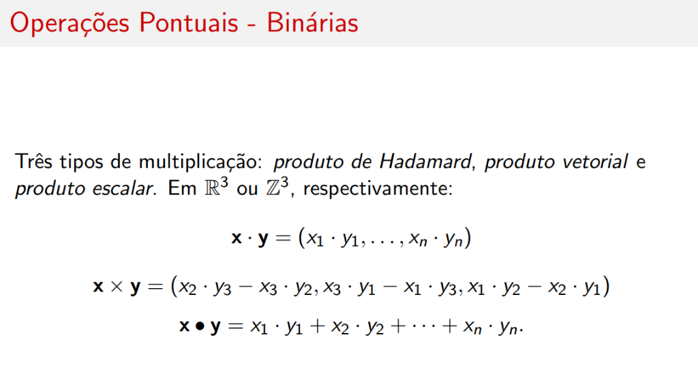
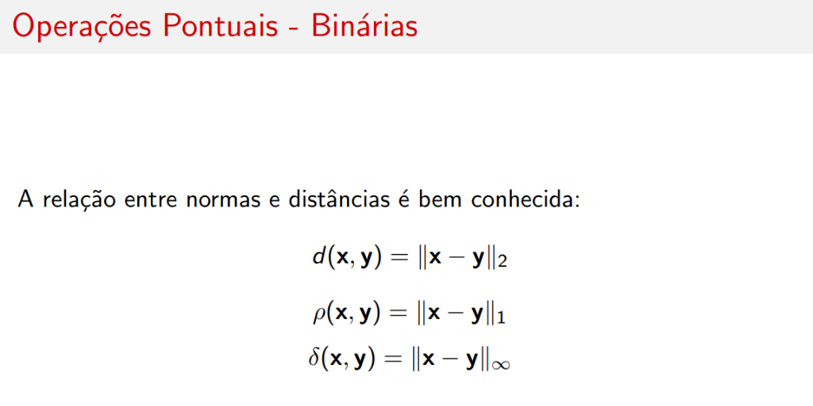
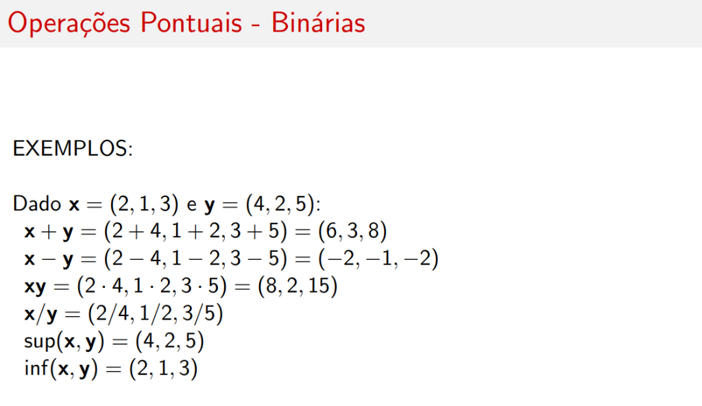

# Operações Binárias

## Introdução

As operações binárias também são **herdadas de espaços métricos clássicos**.

Sejam os elementos \( \mathbf{x} = (x_1, \ldots, x_n) \) e \( \mathbf{y} = (y_1, \ldots, y_n) \) e um escalar \( k \in \mathbb{R} \) (ou \( k \in \mathbb{Z} \)).

---

## Operações Básicas

### Adição de Vetores

\[
\mathbf{x} + \mathbf{y} = (x_1 + y_1, \ldots, x_n + y_n)
\]

### Multiplicação por Escalar

\[
k \cdot \mathbf{x} = (k \cdot x_1, \ldots, k \cdot x_n)
\]

### Adição de Escalar

\[
k + \mathbf{x} = (k + x_1, \ldots, k + x_n)
\]

!!! note "Observação"
    Subtrações são definidas similarmente.

---

## Tipos de Multiplicação

Três tipos de multiplicação em \( \mathbb{R}^3 \) ou \( \mathbb{Z}^3 \):

### Produto de Hadamard (elemento a elemento)

\[
\mathbf{x} \cdot \mathbf{y} = (x_1 \cdot y_1, \ldots, x_n \cdot y_n)
\]

### Produto Vetorial (Cross Product)

\[
\mathbf{x} \times \mathbf{y} = (x_2 \cdot y_3 - x_3 \cdot y_2, \; x_3 \cdot y_1 - x_1 \cdot y_3, \; x_1 \cdot y_2 - x_2 \cdot y_1)
\]

### Produto Escalar (Dot Product)

\[
\mathbf{x} \bullet \mathbf{y} = x_1 \cdot y_1 + x_2 \cdot y_2 + \cdots + x_n \cdot y_n
\]

---

## Distâncias

Temos também as distâncias:

### Distância Euclideana (\( d \))

\[
d(\mathbf{x}, \mathbf{y}) = \sqrt{\sum_{k=1}^{n} (x_k - y_k)^2}
\]

### Distância Manhattan / City Block (\( \rho \))

\[
\rho(\mathbf{x}, \mathbf{y}) = \sum_{k=1}^{n} |x_k - y_k|
\]

### Distância de Chebyshev / Tabuleiro de Xadrez (\( \delta \))

\[
\delta(\mathbf{x}, \mathbf{y}) = \max\{|x_k - y_k| : 1 \leq k \leq n\}
\]

---

## Relação entre Normas e Distâncias

A relação entre normas e distâncias é bem conhecida:

| Distância | Norma Equivalente |
|-----------|-------------------|
| Euclideana \( d(\mathbf{x}, \mathbf{y}) \) | \( \|\mathbf{x} - \mathbf{y}\|_2 \) |
| Manhattan \( \rho(\mathbf{x}, \mathbf{y}) \) | \( \|\mathbf{x} - \mathbf{y}\|_1 \) |
| Chebyshev \( \delta(\mathbf{x}, \mathbf{y}) \) | \( \|\mathbf{x} - \mathbf{y}\|_\infty \) |

---

## Resumo Completo

Dado \( \mathbf{x} = (x_1, x_2, \ldots, x_n), \mathbf{y} = (y_1, y_2, \ldots, y_n) \in \mathbb{R}^n \) e \( \mathbf{z} = (z_1, z_2, \ldots, z_m) \in \mathbb{R}^m \):

| Operação | Definição |
|----------|-----------|
| **Adição** | \( \mathbf{x} + \mathbf{y} = (x_1 + y_1, x_2 + y_2, \ldots, x_n + y_n) \) |
| **Subtração** | \( \mathbf{x} - \mathbf{y} = (x_1 - y_1, x_2 - y_2, \ldots, x_n - y_n) \) |
| **Produto de Hadamard** | \( \mathbf{xy} = (x_1 y_1, x_2 y_2, \ldots, x_n y_n) \) |
| **Divisão** | \( \mathbf{x}/\mathbf{y} = (x_1/y_1, x_2/y_2, \ldots, x_n/y_n) \) |
| **Supremo** | \( \sup(\mathbf{x}, \mathbf{y}) = (x_1 \vee y_1, \ldots, x_n \vee y_n) \) |
| **Ínfimo** | \( \inf(\mathbf{x}, \mathbf{y}) = (x_1 \wedge y_1, \ldots, x_n \wedge y_n) \) |
| **Produto Pontual** | \( \mathbf{x} \bullet \mathbf{y} = x_1 y_1 + x_2 y_2 + \cdots + x_n y_n \) |
| **Produto Cruzado** | \( \mathbf{x} \times \mathbf{y} = (x_2 y_3 - x_3 y_2, x_3 y_1 - x_1 y_3, x_1 y_2 - x_2 y_1) \) |
| **Concatenação** | \( \mathbf{\hat{x}z} = (x_1, \ldots, x_n, z_1, \ldots, z_m) \) |
| **Operações Escalares** | \( k \gamma \mathbf{x} = (k \gamma x_1, \ldots, k \gamma x_n) \) onde \( \gamma = \{+, -, \cdot, \vee, \wedge\} \) |

---

## Exemplos Práticos

Dado \( \mathbf{x} = (2, 1, 3) \) e \( \mathbf{y} = (4, 2, 5) \):

| Operação | Cálculo | Resultado |
|----------|---------|-----------|
| Adição | \( \mathbf{x} + \mathbf{y} = (2+4, 1+2, 3+5) \) | \( (6, 3, 8) \) |
| Subtração | \( \mathbf{x} - \mathbf{y} = (2-4, 1-2, 3-5) \) | \( (-2, -1, -2) \) |
| Produto de Hadamard | \( \mathbf{xy} = (2 \cdot 4, 1 \cdot 2, 3 \cdot 5) \) | \( (8, 2, 15) \) |
| Divisão | \( \mathbf{x}/\mathbf{y} = (2/4, 1/2, 3/5) \) | \( (0.5, 0.5, 0.6) \) |
| Supremo | \( \sup(\mathbf{x}, \mathbf{y}) \) | \( (4, 2, 5) \) |
| Ínfimo | \( \inf(\mathbf{x}, \mathbf{y}) \) | \( (2, 1, 3) \) |

