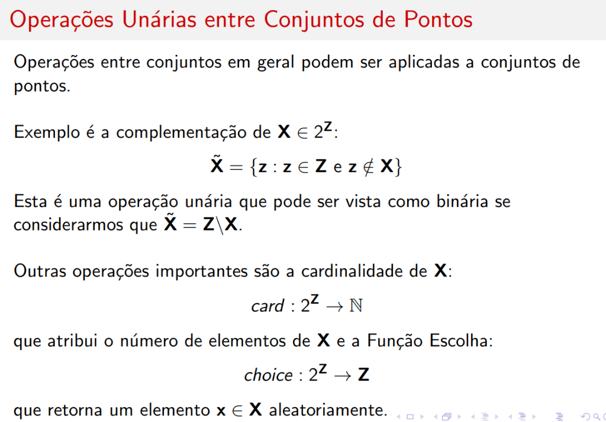
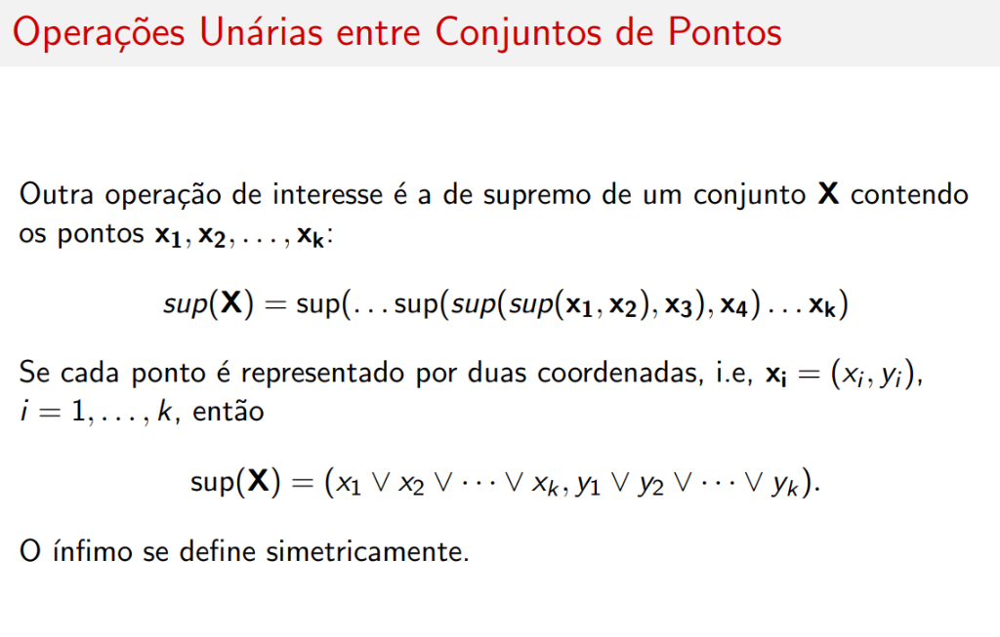
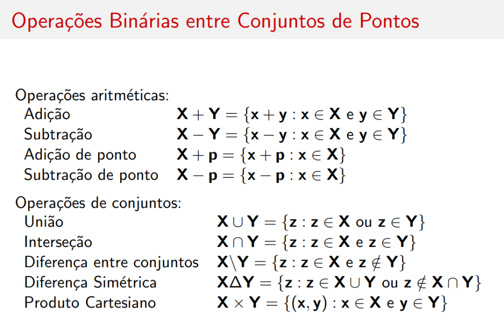

# Operações Entre Conjuntos de Pontos

## Introdução

Operações entre conjuntos em geral podem ser aplicadas a **conjuntos de pontos**.

---

## Operações Unárias sobre Conjuntos

### Complementação

Exemplo é a **complementação** de \( \mathbf{X} \in 2^{\mathbf{Z}} \):

\[
\tilde{\mathbf{X}} = \{\mathbf{z} : \mathbf{z} \in \mathbf{Z} \text{ e } \mathbf{z} \notin \mathbf{X}\}
\]

!!! note "Observação"
    Esta é uma operação unária que pode ser vista como binária se considerarmos que \( \tilde{\mathbf{X}} = \mathbf{Z} \setminus \mathbf{X} \).

### Cardinalidade

Outra operação importante é a **cardinalidade** de \( \mathbf{X} \):

\[
card : 2^{\mathbf{Z}} \rightarrow \mathbb{N}
\]

que atribui o **número de elementos** de \( \mathbf{X} \).

### Função Escolha

A **Função Escolha**:

\[
choice : 2^{\mathbf{Z}} \rightarrow \mathbf{Z}
\]

que retorna um elemento \( \mathbf{x} \in \mathbf{X} \) **aleatoriamente**.

---

## Supremo e Ínfimo de Conjuntos

Outra operação de interesse é o **supremo** de um conjunto \( \mathbf{X} \) contendo os pontos \( \mathbf{x}_1, \mathbf{x}_2, \ldots, \mathbf{x}_k \):

\[
\sup(\mathbf{X}) = \sup(\ldots \sup(\sup(\sup(\mathbf{x}_1, \mathbf{x}_2), \mathbf{x}_3), \mathbf{x}_4) \ldots \mathbf{x}_k)
\]

Se cada ponto é representado por duas coordenadas, i.e., \( \mathbf{x}_i = (x_i, y_i) \), \( i = 1, \ldots, k \), então:

\[
\sup(\mathbf{X}) = (x_1 \vee x_2 \vee \cdots \vee x_k, \; y_1 \vee y_2 \vee \cdots \vee y_k)
\]

!!! note "Ínfimo"
    O ínfimo se define simetricamente usando \( \wedge \) (mínimo).

---

## Resumo: Operações Unárias

| Operação | Definição |
|----------|-----------|
| **Negação** | \( -\mathbf{X} = \{-\mathbf{x} : \mathbf{x} \in \mathbf{X}\} \) |
| **Complementação** | \( \tilde{\mathbf{X}} = \{\mathbf{z} : \mathbf{z} \in \mathbf{Z} \text{ e } \mathbf{z} \notin \mathbf{X}\} \) |
| **Supremo** | \( \sup(\mathbf{X}) \) |
| **Ínfimo** | \( \inf(\mathbf{X}) \) |
| **Função Escolha** | \( choice(\mathbf{X}) \) (elemento aleatório) |
| **Cardinalidade** | \( card(\mathbf{X}) \) |

---

## Operações Binárias entre Conjuntos

### Operações Aritméticas

| Operação | Definição |
|----------|-----------|
| **Adição** | \( \mathbf{X} + \mathbf{Y} = \{\mathbf{x} + \mathbf{y} : \mathbf{x} \in \mathbf{X} \text{ e } \mathbf{y} \in \mathbf{Y}\} \) |
| **Subtração** | \( \mathbf{X} - \mathbf{Y} = \{\mathbf{x} - \mathbf{y} : \mathbf{x} \in \mathbf{X} \text{ e } \mathbf{y} \in \mathbf{Y}\} \) |
| **Adição de ponto** | \( \mathbf{X} + \mathbf{p} = \{\mathbf{x} + \mathbf{p} : \mathbf{x} \in \mathbf{X}\} \) |
| **Subtração de ponto** | \( \mathbf{X} - \mathbf{p} = \{\mathbf{x} - \mathbf{p} : \mathbf{x} \in \mathbf{X}\} \) |

### Operações de Conjuntos

| Operação | Definição |
|----------|-----------|
| **União** | \( \mathbf{X} \cup \mathbf{Y} = \{\mathbf{z} : \mathbf{z} \in \mathbf{X} \text{ ou } \mathbf{z} \in \mathbf{Y}\} \) |
| **Interseção** | \( \mathbf{X} \cap \mathbf{Y} = \{\mathbf{z} : \mathbf{z} \in \mathbf{X} \text{ e } \mathbf{z} \in \mathbf{Y}\} \) |
| **Diferença** | \( \mathbf{X} \setminus \mathbf{Y} = \{\mathbf{z} : \mathbf{z} \in \mathbf{X} \text{ e } \mathbf{z} \notin \mathbf{Y}\} \) |
| **Diferença Simétrica** | \( \mathbf{X} \Delta \mathbf{Y} = \{\mathbf{z} : \mathbf{z} \in \mathbf{X} \cup \mathbf{Y} \text{ ou } \mathbf{z} \notin \mathbf{X} \cap \mathbf{Y}\} \) |
| **Produto Cartesiano** | \( \mathbf{X} \times \mathbf{Y} = \{(\mathbf{x}, \mathbf{y}) : \mathbf{x} \in \mathbf{X} \text{ e } \mathbf{y} \in \mathbf{Y}\} \) |
