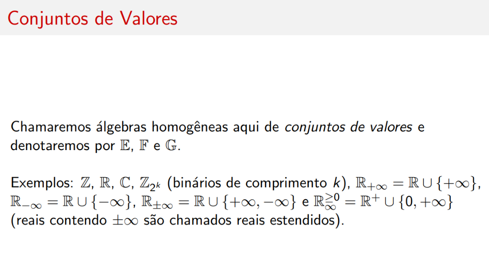
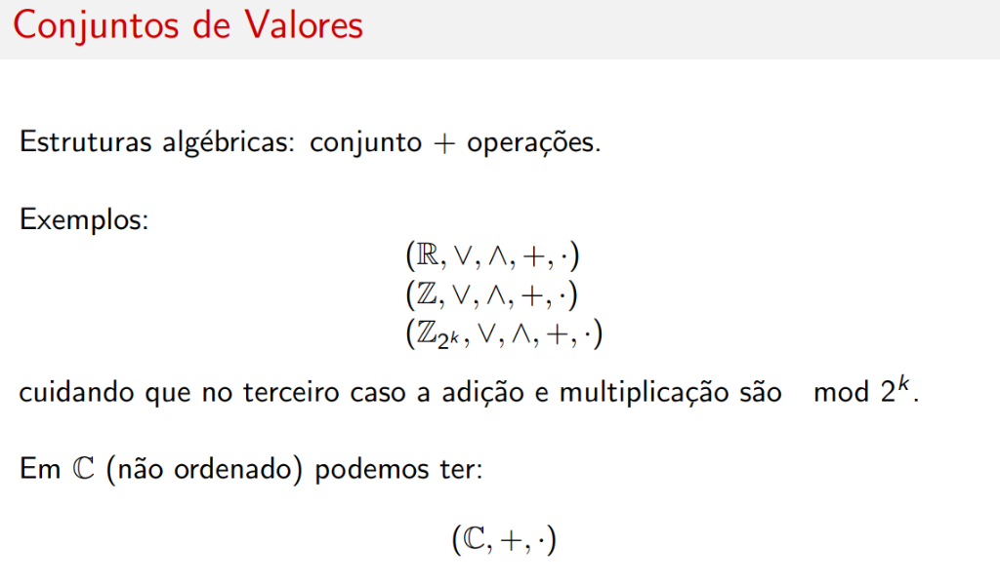
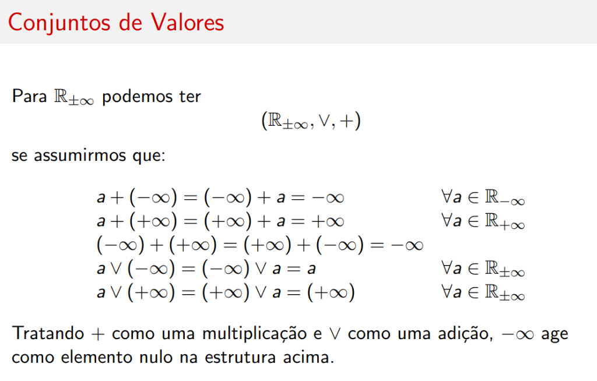
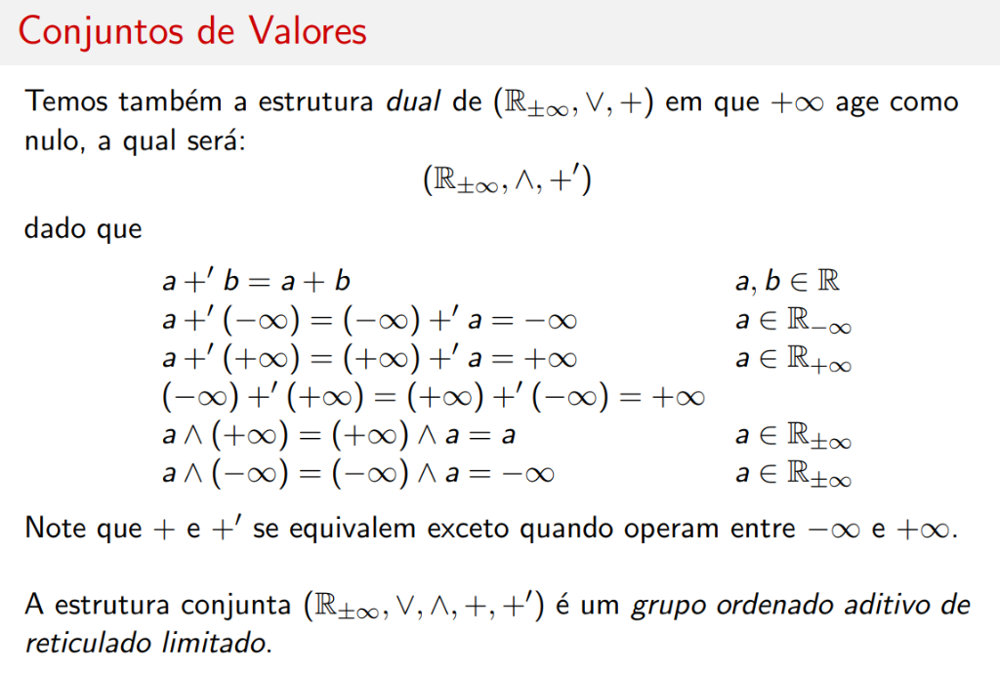
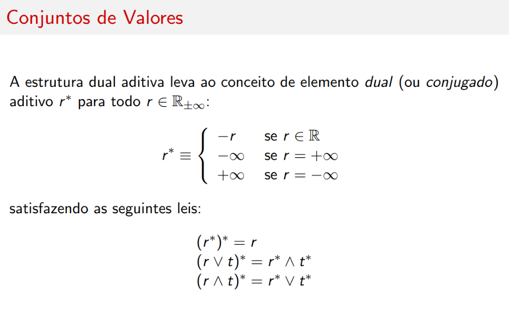
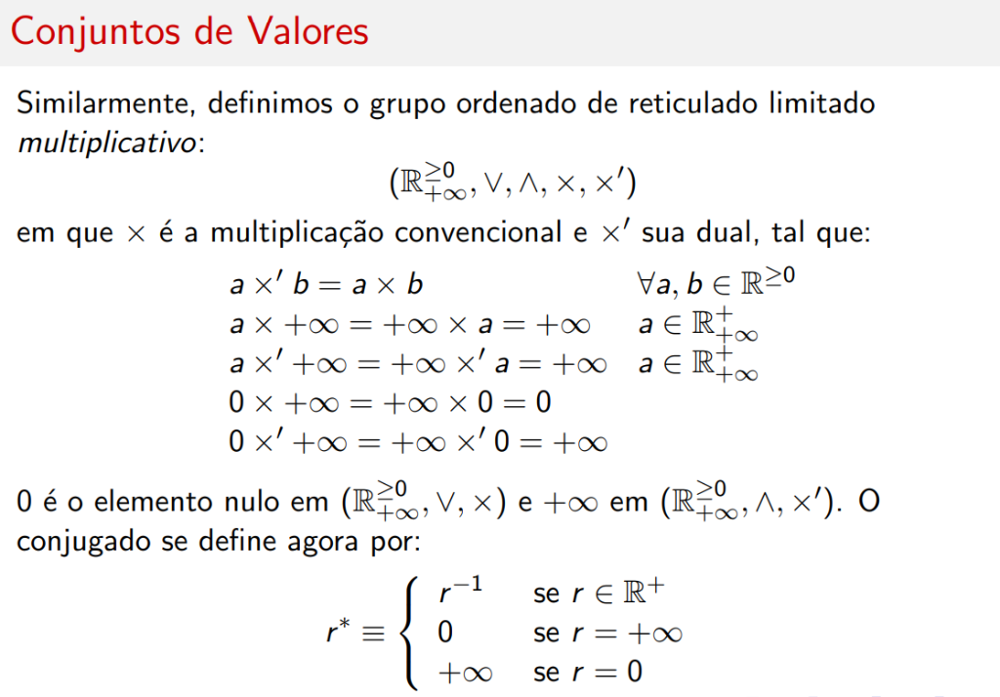
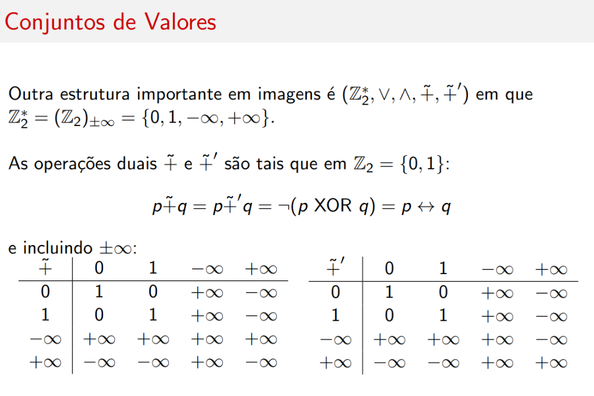
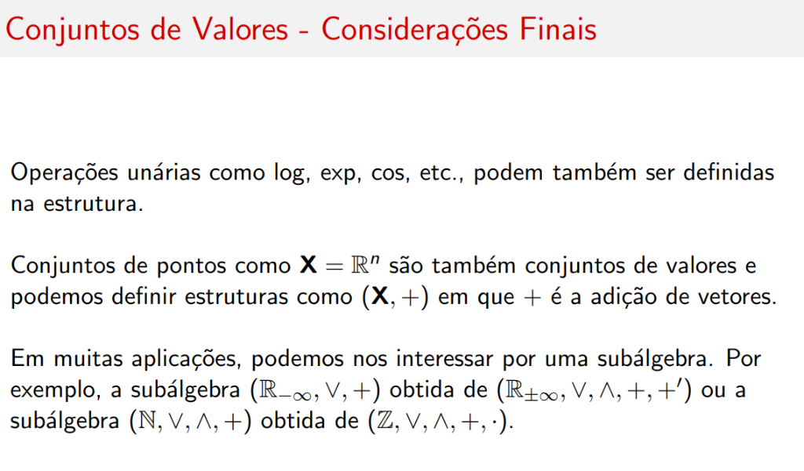

# Conjuntos de Valores

## Introdução

A coleção de pontos, conjuntos de pontos e escalares e das operações que vimos formam uma **álgebra heterogênea**.

- Conjuntos operados podem conter **diferentes tipos de elementos** com tipos específicos de operadores para cada elemento
- Já uma **álgebra homogênea** envolve conjuntos com um mesmo tipo de elementos e um conjunto fixo de operadores sobre estes elementos

---

## Definição

Chamaremos álgebras homogêneas aqui de **conjuntos de valores** e denotaremos por \( \mathbb{E}, \mathbb{F} \) e \( \mathbb{G} \).

### Exemplos de Conjuntos de Valores

| Conjunto | Descrição |
|----------|-----------|
| \( \mathbb{Z} \) | Inteiros |
| \( \mathbb{R} \) | Reais |
| \( \mathbb{C} \) | Complexos |
| \( \mathbb{Z}_{2^k} \) | Binários de comprimento \( k \) |
| \( \mathbb{R}_{+\infty} = \mathbb{R} \cup \{+\infty\} \) | Reais estendidos (+∞) |
| \( \mathbb{R}_{-\infty} = \mathbb{R} \cup \{-\infty\} \) | Reais estendidos (-∞) |
| \( \mathbb{R}_{\pm\infty} = \mathbb{R} \cup \{+\infty, -\infty\} \) | Reais estendidos (±∞) |
| \( \mathbb{R}_\infty^{\geq 0} = \mathbb{R}^+ \cup \{0, +\infty\} \) | Reais não-negativos estendidos |

!!! info "Reais Estendidos"
    Reais contendo \( \pm\infty \) são chamados **reais estendidos**.

---

## Estruturas Algébricas

**Estruturas algébricas**: conjunto + operações.

### Exemplos

| Estrutura | Operações |
|-----------|-----------|
| \( (\mathbb{R}, \vee, \wedge, +, \cdot) \) | Máximo, mínimo, soma, produto |
| \( (\mathbb{Z}, \vee, \wedge, +, \cdot) \) | Máximo, mínimo, soma, produto |
| \( (\mathbb{Z}_{2^k}, \vee, \wedge, +, \cdot) \) | Operações mod \( 2^k \) |
| \( (\mathbb{C}, +, \cdot) \) | Soma, produto (não ordenado) |

!!! warning "Atenção"
    No caso de \( \mathbb{Z}_{2^k} \), a adição e multiplicação são **mod \( 2^k \)**.

---

## Reais Estendidos com Máximo

Para \( \mathbb{R}_{\pm\infty} \) podemos ter a estrutura:

\[
(\mathbb{R}_{\pm\infty}, \vee, +)
\]

se assumirmos que:

| Operação | Resultado | Condição |
|----------|-----------|----------|
| \( a + (-\infty) = (-\infty) + a \) | \( -\infty \) | \( \forall a \in \mathbb{R}_{-\infty} \) |
| \( a + (+\infty) = (+\infty) + a \) | \( +\infty \) | \( \forall a \in \mathbb{R}_{+\infty} \) |
| \( (-\infty) + (+\infty) = (+\infty) + (-\infty) \) | \( -\infty \) | |
| \( a \vee (-\infty) = (-\infty) \vee a \) | \( a \) | \( \forall a \in \mathbb{R}_{\pm\infty} \) |
| \( a \vee (+\infty) = (+\infty) \vee a \) | \( +\infty \) | \( \forall a \in \mathbb{R}_{\pm\infty} \) |

!!! tip "Elemento Nulo"
    Tratando \( + \) como uma multiplicação e \( \vee \) como uma adição, \( -\infty \) age como **elemento nulo** na estrutura acima.

---

## Estrutura Dual

Temos também a estrutura **dual** de \( (\mathbb{R}_{\pm\infty}, \vee, +) \) em que \( +\infty \) age como nulo:

\[
(\mathbb{R}_{\pm\infty}, \wedge, +')
\]

### Operador \( +' \) (Dual)

| Operação | Resultado | Condição |
|----------|-----------|----------|
| \( a +' b \) | \( a + b \) | \( a, b \in \mathbb{R} \) |
| \( a +' (-\infty) = (-\infty) +' a \) | \( -\infty \) | \( a \in \mathbb{R}_{-\infty} \) |
| \( a +' (+\infty) = (+\infty) +' a \) | \( +\infty \) | \( a \in \mathbb{R}_{+\infty} \) |
| \( (-\infty) +' (+\infty) = (+\infty) +' (-\infty) \) | \( +\infty \) | |
| \( a \wedge (+\infty) = (+\infty) \wedge a \) | \( a \) | \( a \in \mathbb{R}_{\pm\infty} \) |
| \( a \wedge (-\infty) = (-\infty) \wedge a \) | \( -\infty \) | \( a \in \mathbb{R}_{\pm\infty} \) |

!!! note "Equivalência"
    Note que \( + \) e \( +' \) se equivalem exceto quando operam entre \( -\infty \) e \( +\infty \).

!!! success "Estrutura Resultante"
    A estrutura conjunta \( (\mathbb{R}_{\pm\infty}, \vee, \wedge, +, +') \) é um **grupo ordenado aditivo de reticulado limitado**.

---

## Elemento Dual (Conjugado)

A estrutura dual aditiva leva ao conceito de **elemento dual** (ou **conjugado**) aditivo \( r^* \) para todo \( r \in \mathbb{R}_{\pm\infty} \):

\[
r^* \equiv \begin{cases} -r & \text{se } r \in \mathbb{R} \\ -\infty & \text{se } r = +\infty \\ +\infty & \text{se } r = -\infty \end{cases}
\]

### Leis do Conjugado

| Lei | Descrição |
|-----|-----------|
| \( (r^*)^* = r \) | Involução |
| \( (r \vee t)^* = r^* \wedge t^* \) | De Morgan |
| \( (r \wedge t)^* = r^* \vee t^* \) | De Morgan |

---

## Estrutura Multiplicativa

Similarmente, definimos o **grupo ordenado de reticulado limitado multiplicativo**:

\[
(\mathbb{R}_{+\infty}^{\geq 0}, \vee, \wedge, \times, \times')
\]

onde \( \times \) é a multiplicação convencional e \( \times' \) sua dual:

| Operação | Resultado | Condição |
|----------|-----------|----------|
| \( a \times' b \) | \( a \times b \) | \( \forall a, b \in \mathbb{R}^{\geq 0} \) |
| \( a \times +\infty = +\infty \times a \) | \( +\infty \) | \( a \in \mathbb{R}_{+\infty}^+ \) |
| \( a \times' +\infty = +\infty \times' a \) | \( +\infty \) | \( a \in \mathbb{R}_{+\infty}^+ \) |
| \( 0 \times +\infty = +\infty \times 0 \) | \( 0 \) | |
| \( 0 \times' +\infty = +\infty \times' 0 \) | \( +\infty \) | |

!!! note "Elementos Nulos"
    - \( 0 \) é o elemento nulo em \( (\mathbb{R}_{+\infty}^{\geq 0}, \vee, \times) \)
    - \( +\infty \) é o elemento nulo em \( (\mathbb{R}_{+\infty}^{\geq 0}, \wedge, \times') \)

### Conjugado Multiplicativo

\[
r^* \equiv \begin{cases} r^{-1} & \text{se } r \in \mathbb{R}^+ \\ 0 & \text{se } r = +\infty \\ +\infty & \text{se } r = 0 \end{cases}
\]

---

## Binários Estendidos

Outra estrutura importante em imagens é \( (\mathbb{Z}_2^*, \vee, \wedge, \tilde{+}, \tilde{+}') \) em que:

\[
\mathbb{Z}_2^* = (\mathbb{Z}_2)_{\pm\infty} = \{0, 1, -\infty, +\infty\}
\]

As operações duais \( \tilde{+} \) e \( \tilde{+}' \) são tais que em \( \mathbb{Z}_2 = \{0, 1\} \):

\[
p \tilde{+} q = p \tilde{+}' q = \neg(p \text{ XOR } q) = p \leftrightarrow q
\]

### Tabelas de Operação

**Operador** \( \tilde{+} \):

|   | **0** | **1** | **-∞** | **+∞** |
|---|:-----:|:-----:|:------:|:------:|
| **0** | 1 | 0 | +∞ | -∞ |
| **1** | 0 | 1 | +∞ | -∞ |
| **-∞** | +∞ | +∞ | +∞ | +∞ |
| **+∞** | -∞ | -∞ | +∞ | -∞ |

**Operador** \( \tilde{+}' \):

|   | **0** | **1** | **-∞** | **+∞** |
|---|:-----:|:-----:|:------:|:------:|
| **0** | 1 | 0 | +∞ | -∞ |
| **1** | 0 | 1 | +∞ | -∞ |
| **-∞** | +∞ | +∞ | +∞ | -∞ |
| **+∞** | -∞ | -∞ | -∞ | +∞ |

---

## Generalização para Produto Cartesiano

Estas operações podem ser generalizadas para o **produto cartesiano**:

\[
\mathbb{Z}_{2^k}^* = \mathbb{Z}_2^* \times \mathbb{Z}_2^* \times \cdots \times \mathbb{Z}_2^*
\]

Por exemplo, se \( m = (m_1, \ldots, m_k) \) e \( n = (n_1, \ldots, n_k) \):

\[
m \tilde{+} n = (m_1 \tilde{+} n_1, \ldots, m_k \tilde{+} n_k)
\]

---

## Considerações Finais

- **Operações unárias** como \( \log, \exp, \cos \), etc., podem também ser definidas na estrutura

- **Conjuntos de pontos** como \( \mathbf{X} = \mathbb{R}^n \) são também conjuntos de valores e podemos definir estruturas como \( (\mathbf{X}, +) \) em que \( + \) é a adição de vetores

- Em muitas aplicações, podemos nos interessar por uma **subálgebra**. Por exemplo:
    - A subálgebra \( (\mathbb{R}_{-\infty}, \vee, +) \) obtida de \( (\mathbb{R}_{\pm\infty}, \vee, \wedge, +, +') \)
    - A subálgebra \( (\mathbb{N}, \vee, \wedge, +) \) obtida de \( (\mathbb{Z}, \vee, \wedge, +, \cdot) \)

