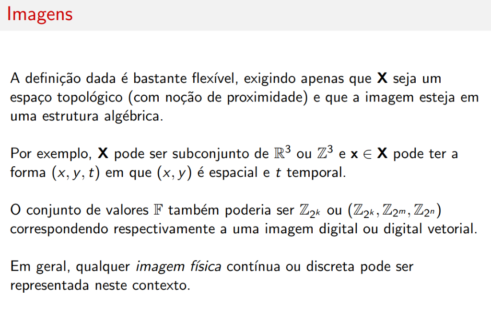

# Imagens

## Notação

Vamos denotar por \( A^B \) o conjunto de todas as funções \( f : B \rightarrow A \).

---

## Definição Formal de Imagem

Seja \( \mathbb{F} \) um conjunto de valores e \( \mathbf{X} \) um conjunto de pontos.

!!! abstract "Definição"
    Uma **imagem \( \mathbb{F} \)-valorada** em \( \mathbf{X} \) é qualquer elemento de \( \mathbb{F}^{\mathbf{X}} \).
    
    - \( \mathbb{F} \) é o chamado conjunto de **possíveis intervalos de valores**
    - \( \mathbf{X} \) é o **domínio espacial** da imagem

---

## Representação como Gráfico

Tanto no contexto cotidiano quanto computacional (processamento de imagens, computação gráfica) é comum que a imagem seja representada por seu **gráfico** (ou **estrutura de dados**).

Tal estrutura é dada por um **conjunto de pares**:

\[
\mathbf{a} = \{(\mathbf{x}, \mathbf{a}(\mathbf{x})) : \mathbf{x} \in \mathbf{X}\}
\]

### Terminologia

| Elemento | Nome | Descrição |
|----------|------|-----------|
| \( (\mathbf{x}, \mathbf{a}(\mathbf{x})) \) | **Pixel** (*picture element*) | Par ponto-valor |
| \( \mathbf{x} \) | **Ponto na imagem** | Localização do pixel |
| \( \mathbf{a}(\mathbf{x}) \) | **Valor do pixel** | Intensidade, cor, etc. |

---

## Flexibilidade da Definição

A definição dada é bastante **flexível**, exigindo apenas que:

- \( \mathbf{X} \) seja um espaço topológico (com noção de proximidade)
- A imagem esteja em uma estrutura algébrica

### Exemplos de Domínios

\( \mathbf{X} \) pode ser subconjunto de \( \mathbb{R}^3 \) ou \( \mathbb{Z}^3 \) e \( \mathbf{x} \in \mathbf{X} \) pode ter a forma:

\[
(x, y, t)
\]

onde \( (x, y) \) é **espacial** e \( t \) é **temporal**.

### Exemplos de Conjuntos de Valores

| Conjunto de Valores \( \mathbb{F} \) | Tipo de Imagem |
|--------------------------------------|----------------|
| \( \mathbb{Z}_{2^k} \) | Imagem digital (escala de cinza) |
| \( (\mathbb{Z}_{2^k}, \mathbb{Z}_{2^m}, \mathbb{Z}_{2^n}) \) | Imagem digital vetorial (RGB, etc.) |

!!! info "Generalidade"
    Em geral, qualquer **imagem física** contínua ou discreta pode ser representada neste contexto.
