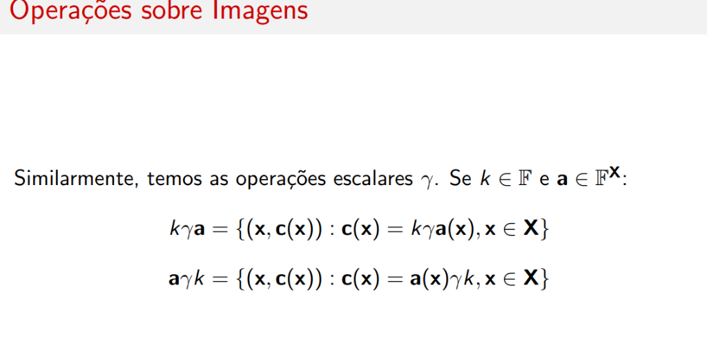
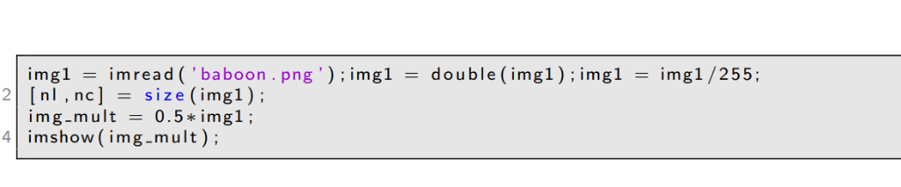
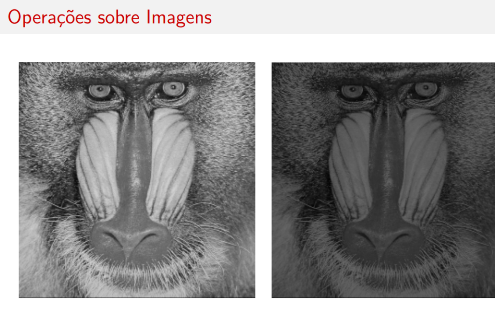
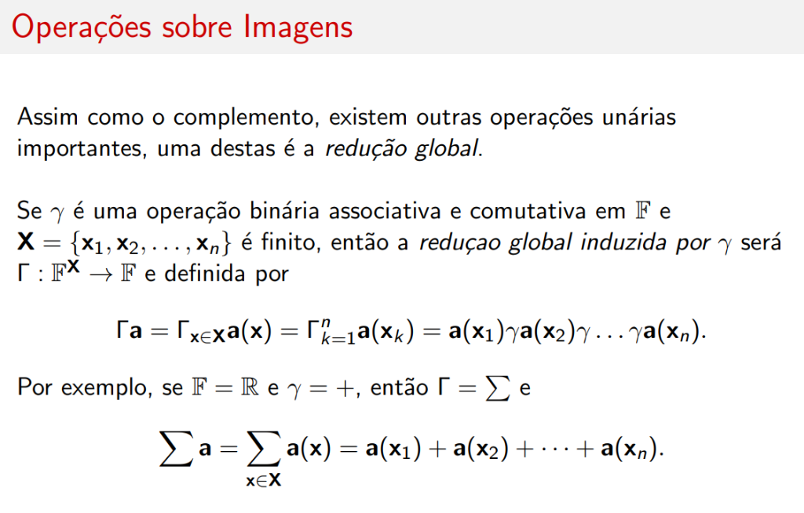
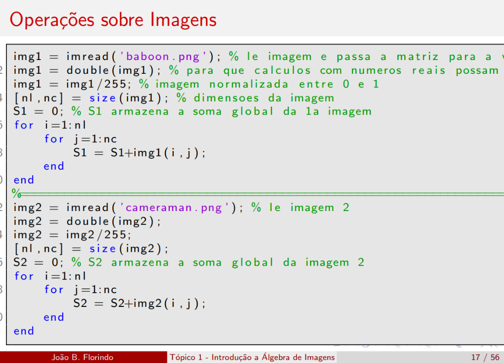
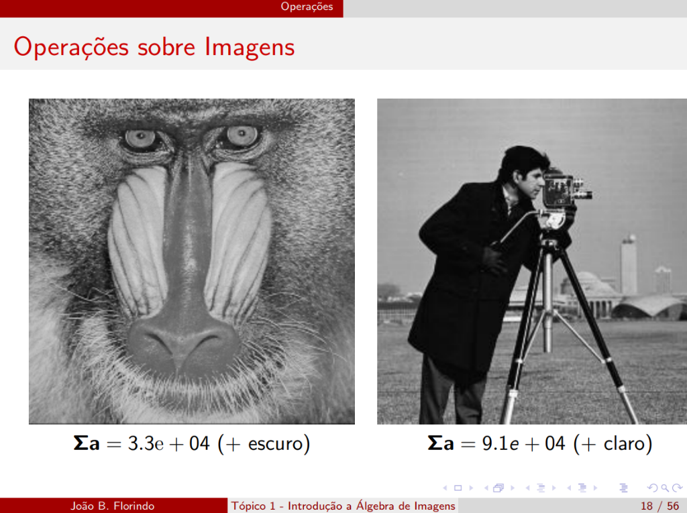

# Operações sobre Imagens

## Introdução

Vejamos as operações sobre ou entre imagens \( \mathbb{F} \)-valoradas.


Se \( \gamma \) é uma operação binária em \( \mathbb{F} \), ela também será uma operação binária em \( \mathbb{F}^{\mathbf{X}} \).

---

## Operações Binárias entre Imagens

Partindo de \( \mathbf{a}, \mathbf{b} \in \mathbb{F} \), a operação será dada por:

\[
\mathbf{a} \gamma \mathbf{b} = \{(\mathbf{x}, \mathbf{c}(\mathbf{x})) : \mathbf{c}(\mathbf{x}) = \mathbf{a}(\mathbf{x}) \gamma \mathbf{b}(\mathbf{x}), \mathbf{x} \in \mathbf{X}\}
\]

### Exemplo com estrutura \( (\mathbb{R}, +, \cdot, \vee, \wedge) \)

Seja a estrutura \( (\mathbb{R}, +, \cdot, \vee, \wedge) \) e \( \mathbf{a}, \mathbf{b} \in \mathbb{R}^{\mathbf{X}} \). Então teremos:

| Operação | Definição |
|----------|-----------|
| **Adição** | \( \mathbf{a} + \mathbf{b} = \{(\mathbf{x}, \mathbf{c}(\mathbf{x})) : \mathbf{c}(\mathbf{x}) = \mathbf{a}(\mathbf{x}) + \mathbf{b}(\mathbf{x})\} \) |
| **Produto** | \( \mathbf{a} \cdot \mathbf{b} = \{(\mathbf{x}, \mathbf{c}(\mathbf{x})) : \mathbf{c}(\mathbf{x}) = \mathbf{a}(\mathbf{x}) \cdot \mathbf{b}(\mathbf{x})\} \) |
| **Máximo** | \( \mathbf{a} \vee \mathbf{b} = \{(\mathbf{x}, \mathbf{c}(\mathbf{x})) : \mathbf{c}(\mathbf{x}) = \mathbf{a}(\mathbf{x}) \vee \mathbf{b}(\mathbf{x})\} \) |
| **Mínimo** | \( \mathbf{a} \wedge \mathbf{b} = \{(\mathbf{x}, \mathbf{c}(\mathbf{x})) : \mathbf{c}(\mathbf{x}) = \mathbf{a}(\mathbf{x}) \wedge \mathbf{b}(\mathbf{x})\} \) |

---

## Operações Escalares



Similarmente, temos as **operações escalares** \( \gamma \). Se \( k \in \mathbb{F} \) e \( \mathbf{a} \in \mathbb{F}^{\mathbf{X}} \):

\[
k \gamma \mathbf{a} = \{(\mathbf{x}, \mathbf{c}(\mathbf{x})) : \mathbf{c}(\mathbf{x}) = k \gamma \mathbf{a}(\mathbf{x}), \mathbf{x} \in \mathbf{X}\}
\]

\[
\mathbf{a} \gamma k = \{(\mathbf{x}, \mathbf{c}(\mathbf{x})) : \mathbf{c}(\mathbf{x}) = \mathbf{a}(\mathbf{x}) \gamma k, \mathbf{x} \in \mathbf{X}\}
\]

### Imagens Reais


No caso das imagens reais, para \( k \in \mathbb{R} \):

| Operação | Definição |
|----------|-----------|
| **Multiplicação** | \( k \cdot \mathbf{a} = \{(\mathbf{x}, \mathbf{c}(\mathbf{x})) : \mathbf{c}(\mathbf{x}) = k \cdot \mathbf{a}(\mathbf{x}), \mathbf{x} \in \mathbf{X}\} \) |
| **Adição** | \( k + \mathbf{a} = \{(\mathbf{x}, \mathbf{c}(\mathbf{x})) : \mathbf{c}(\mathbf{x}) = k + \mathbf{a}(\mathbf{x}), \mathbf{x} \in \mathbf{X}\} \) |

---

## Exemplo Prático (MATLAB)


```matlab
img1 = imread('cameraman.png'); img1 = double(img1); img1 = img1/255;
img2 = imread('goldhill.png'); img2 = double(img2); img2 = img2/255;
img3 = imread('cat.png'); img3 = double(img3); img3 = img3/255;
img4 = imread('rabbit.png'); img4 = double(img4); img4 = img4/255;

[nl, nc] = size(img1); % presume-se que todas as imagens tenham o mesmo tamanho
img_soma = zeros(nl, nc); img_max = zeros(nl, nc);

for i = 1:nl
    for j = 1:nc
        img_soma(i, j) = img1(i, j) + img2(i, j);
        img_max(i, j) = max(img3(i, j), img4(i, j));
    end
end

figure; imshow(img_soma); title('Soma de imagens');
figure; imshow(img_max); title('Maximo de imagens');
```

---

## Resultados Visuais


| Operação | Imagens de Entrada | Resultado |
|----------|-------------------|-----------|
| **Soma** \( \mathbf{a} + \mathbf{b} \) | Cameraman + Goldhill | Sobreposição das duas imagens |
| **Máximo** \( \mathbf{a} \vee \mathbf{b} \) | Cat + Rabbit | União das silhuetas |

---

## Exemplo Matricial


Seja a imagem \( \mathbf{a} \in (\mathbb{Z}_3 \times \mathbb{Z}_3)^{\mathbb{R}} \) com valores dados pela matriz \( A_{ij} \):

\[
A = \begin{bmatrix} 4 & 11 & -1 \\ 3 & 7 & 2 \\ 1 & -4 & 9 \end{bmatrix}
\]

Para \( k = 4 \) teríamos a matriz para \( k \cdot \mathbf{a} \):

\[
C = \begin{bmatrix} 16 & 44 & -4 \\ 12 & 28 & 8 \\ 4 & -16 & 36 \end{bmatrix}
\]

E para \( k + \mathbf{a} \):

\[
C = \begin{bmatrix} 8 & 15 & 3 \\ 7 & 11 & 6 \\ 5 & 0 & 13 \end{bmatrix}
\]

---

## Multiplicação por Escalar (Visual)



```matlab
img1 = imread('baboon.png'); img1 = double(img1); img1 = img1/255;
[nl, nc] = size(img1);
img_mult = 0.5 * img1;
imshow(img_mult);
```



A imagem resultante tem brilho reduzido proporcionalmente ao fator \( k = 0.5 \).

---

## Imagens Conjunto-Valoradas


Sobretudo em aplicações de alto nível em visão computacional, podemos nos deparar com **imagens vetoriais** ou com um **conjunto de valores** associado a cada pixel.

Uma **imagem conjunto-valorada** tem a forma:

\[
\mathbf{a} : \mathbf{X} \rightarrow 2^{\mathbb{F}}
\]

A estrutura algébrica é \( (2^{\mathbb{F}}, \cup, \cap, \tilde{}) \), em que \( \tilde{} \) denota o complemento de conjunto.

Se \( \mathbf{a}, \mathbf{b} \in (2^{\mathbb{F}})^{\mathbf{X}} \):

| Operação | Definição |
|----------|-----------|
| **União** | \( \mathbf{a} \cup \mathbf{b} = \{(\mathbf{x}, \mathbf{c}(\mathbf{x})) : \mathbf{c}(\mathbf{x}) = \mathbf{a}(\mathbf{x}) \cup \mathbf{b}(\mathbf{x})\} \) |
| **Interseção** | \( \mathbf{a} \cap \mathbf{b} = \{(\mathbf{x}, \mathbf{c}(\mathbf{x})) : \mathbf{c}(\mathbf{x}) = \mathbf{a}(\mathbf{x}) \cap \mathbf{b}(\mathbf{x})\} \) |
| **Complemento** | \( \tilde{\mathbf{a}} = \{(\mathbf{x}, \mathbf{c}(\mathbf{x})) : \mathbf{c}(\mathbf{x}) = \mathbb{F} \setminus \mathbf{a}(\mathbf{x})\} \) |

---

## Redução Global



Assim como o complemento, existem outras **operações unárias** importantes. Uma destas é a **redução global**.

Se \( \gamma \) é uma operação binária associativa e comutativa em \( \mathbb{F} \) e \( \mathbf{X} = \{\mathbf{x}_1, \mathbf{x}_2, \ldots, \mathbf{x}_n\} \) é finito, então a **redução global induzida por \( \gamma \)** será:

\[
\Gamma : \mathbb{F}^{\mathbf{X}} \rightarrow \mathbb{F}
\]

definida por:

\[
\Gamma \mathbf{a} = \Gamma_{\mathbf{x} \in \mathbf{X}} \mathbf{a}(\mathbf{x}) = \Gamma_{k=1}^{n} \mathbf{a}(\mathbf{x}_k) = \mathbf{a}(\mathbf{x}_1) \gamma \mathbf{a}(\mathbf{x}_2) \gamma \ldots \gamma \mathbf{a}(\mathbf{x}_n)
\]

### Exemplo

Por exemplo, se \( \mathbb{F} = \mathbb{R} \) e \( \gamma = + \), então \( \Gamma = \sum \) e:

\[
\sum \mathbf{a} = \sum_{\mathbf{x} \in \mathbf{X}} \mathbf{a}(\mathbf{x}) = \mathbf{a}(\mathbf{x}_1) + \mathbf{a}(\mathbf{x}_2) + \cdots + \mathbf{a}(\mathbf{x}_n)
\]

!!! tip "Aplicação"
    A soma global é usada para calcular a **intensidade total** de uma imagem, útil em normalização e análise estatística.

### Exemplo Prático (MATLAB)



```matlab
img1 = imread('baboon.png');    % le imagem e passa a matriz para a variavel
img1 = double(img1);            % para que calculos com numeros reais possam ser feitos
img1 = img1/255;                % imagem normalizada entre 0 e 1
[nl, nc] = size(img1);          % dimensoes da imagem
S1 = 0;                         % S1 armazena a soma global da 1a imagem
for i = 1:nl
    for j = 1:nc
        S1 = S1 + img1(i, j);
    end
end
%------------------------------------------
img2 = imread('cameraman.png'); % le imagem 2
img2 = double(img2);
img2 = img2/255;
[nl, nc] = size(img2);
S2 = 0;                         % S2 armazena a soma global da imagem 2
for i = 1:nl
    for j = 1:nc
        S2 = S2 + img2(i, j);
    end
end
```

### Resultado Visual



| Imagem | Soma Global | Interpretação |
|--------|-------------|---------------|
| **Baboon** | \( \Sigma \mathbf{a} = 3.3 \times 10^4 \) | Imagem mais **escura** |
| **Cameraman** | \( \Sigma \mathbf{a} = 9.1 \times 10^4 \) | Imagem mais **clara** |

!!! info "Observação"
    A soma global reflete a **intensidade média** da imagem. Imagens mais claras têm soma global maior.

