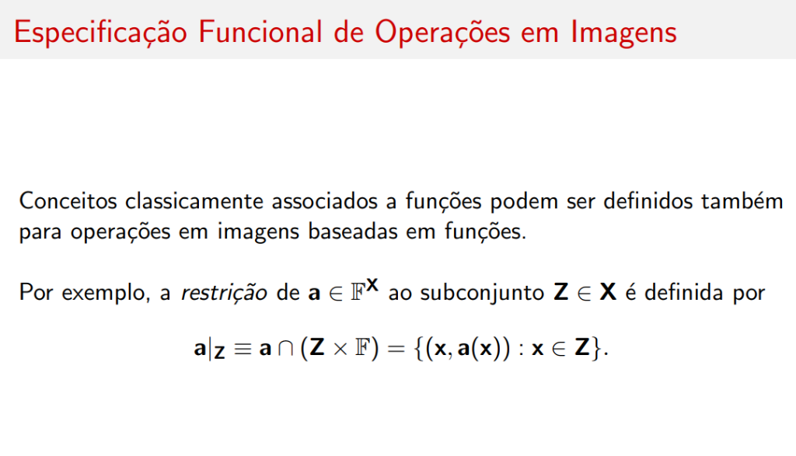
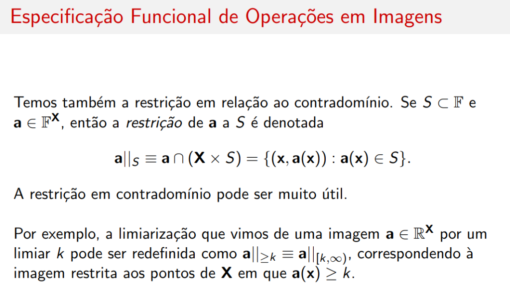
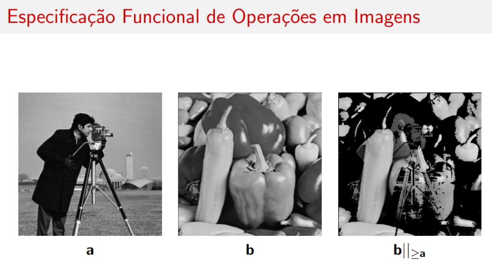
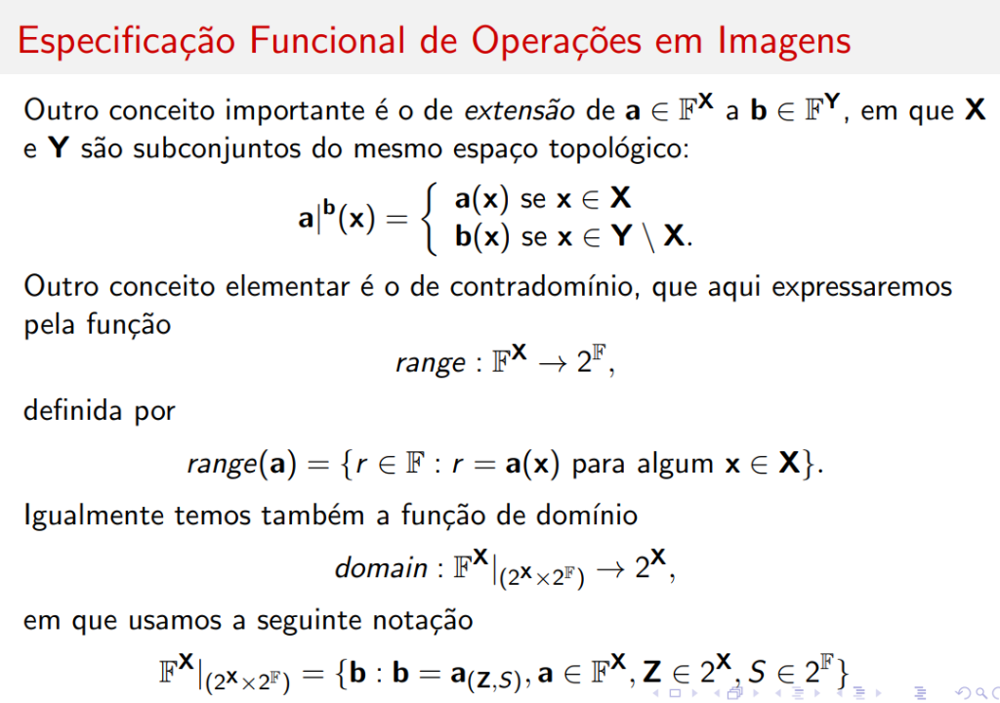
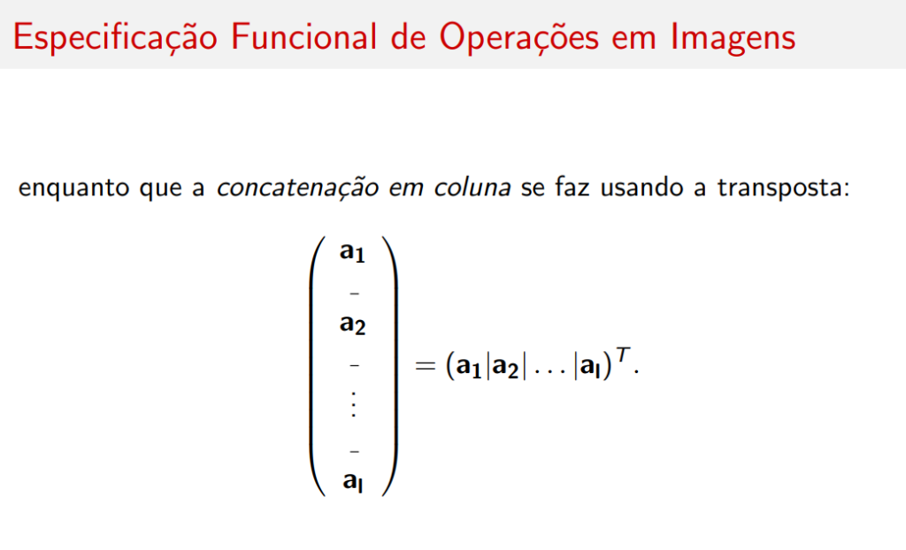

# Especificação Funcional

## Introdução



Conceitos classicamente associados a funções podem ser definidos também para **operações em imagens** baseadas em funções.

---

## Restrição em Domínio

Por exemplo, a **restrição** de \( \mathbf{a} \in \mathbb{F}^{\mathbf{X}} \) ao subconjunto \( \mathbf{Z} \in \mathbf{X} \) é definida por:

\[
\mathbf{a}|_{\mathbf{Z}} \equiv \mathbf{a} \cap (\mathbf{Z} \times \mathbb{F}) = \{(\mathbf{x}, \mathbf{a}(\mathbf{x})) : \mathbf{x} \in \mathbf{Z}\}
\]

!!! info "Interpretação"
    A restrição em domínio "recorta" a imagem, mantendo apenas os pixels cujas coordenadas pertencem ao conjunto \( \mathbf{Z} \).

---

## Restrição em Contradomínio



Temos também a restrição em relação ao **contradomínio**. Se \( S \subset \mathbb{F} \) e \( \mathbf{a} \in \mathbb{F}^{\mathbf{X}} \), então a **restrição** de \( \mathbf{a} \) a \( S \) é denotada:

\[
\mathbf{a}||_S \equiv \mathbf{a} \cap (\mathbf{X} \times S) = \{(\mathbf{x}, \mathbf{a}(\mathbf{x})) : \mathbf{a}(\mathbf{x}) \in S\}
\]

A restrição em contradomínio pode ser muito útil.

### Exemplo: Limiarização

Por exemplo, a limiarização que vimos de uma imagem \( \mathbf{a} \in \mathbb{R}^{\mathbf{X}} \) por um limiar \( k \) pode ser redefinida como:

\[
\mathbf{a}||_{\geq k} \equiv \mathbf{a}||_{[k,\infty)}
\]

correspondendo à imagem restrita aos pontos de \( \mathbf{X} \) em que \( \mathbf{a}(\mathbf{x}) \geq k \).

---

## Exemplo Prático (MATLAB)


```matlab
clear;
img = imread('cameraman.png'); img = double(img); img = img/255;
[nl, nc] = size(img);

% Restrição em domínio (círculo de raio 50)
for i = 1:nl
    for j = 1:nc
        if (i - nl/2)^2 + (j - nc/2)^2 <= 2500
            img2(i, j) = img(i, j);
        else
            img2(i, j) = 0;
        end
    end
end

% Restrição em contradomínio (valores primos)
for i = 1:nl
    for j = 1:nc
        if isprime(round(img(i, j) * 255))
            img3(i, j) = img(i, j);
        else
            img3(i, j) = 0;
        end
    end
end

figure; imshow(img2); title('Restricao de dominio');
figure; imshow(img3); title('Restricao de contradominio');
```

---

## Resultado Visual


| Imagem | Descrição |
|--------|-----------|
| **a** (Original) | Imagem Cameraman |
| **a\|círculo** | Restrição em domínio: apenas pixels dentro do círculo de raio 50 |
| **a\|\|primo** | Restrição em contradomínio: apenas pixels cujo valor (0-255) é primo |

---

## Restrição com Imagem como Conjunto


O conjunto \( S \) também pode ser uma **imagem**: \( S \in (2^{\mathbb{F}})^{\mathbf{X}} \), e neste caso:

\[
\mathbf{a}||_S = \{(\mathbf{x}, \mathbf{a}(\mathbf{x})) : \mathbf{a}(\mathbf{x}) \in S(\mathbf{x})\}
\]

### Exemplo

Por exemplo, se \( \mathbf{a}, \mathbf{b} \in \mathbb{R}^{\mathbf{X}} \):

\[
\mathbf{a}||_{\leq \mathbf{b}} \equiv \{(\mathbf{x}, \mathbf{a}(\mathbf{x})) : \mathbf{a}(\mathbf{x}) \leq \mathbf{b}(\mathbf{x})\}
\]

---

## Definição Geral

Combinando a restrição em domínio com a de contradomínio temos a **definição geral**.

Seja \( \mathbf{a} \in \mathbb{F}^{\mathbf{X}} \), \( \mathbf{Z} \subset \mathbf{X} \), \( S \subset \mathbb{F} \), então a **restrição de \( \mathbf{a} \) a \( \mathbf{Z} \) e \( S \)** é dada por:

\[
\mathbf{a}||_{\mathbf{Z},S} = \mathbf{a} \cap (\mathbf{Z}, S) = \{(\mathbf{x}, \mathbf{a}(\mathbf{x})) : \mathbf{x} \in \mathbf{Z} \text{ e } \mathbf{a}(\mathbf{x}) \in S\}
\]

---

## Resumo

| Tipo de Restrição | Notação | Condição |
|-------------------|---------|----------|
| **Domínio** | \( \mathbf{a}\|_{\mathbf{Z}} \) | \( \mathbf{x} \in \mathbf{Z} \) |
| **Contradomínio** | \( \mathbf{a}\|\|_S \) | \( \mathbf{a}(\mathbf{x}) \in S \) |
| **Contradomínio (imagem)** | \( \mathbf{a}\|\|_S \) | \( \mathbf{a}(\mathbf{x}) \in S(\mathbf{x}) \) |
| **Geral** | \( \mathbf{a}\|\|_{\mathbf{Z},S} \) | \( \mathbf{x} \in \mathbf{Z} \) e \( \mathbf{a}(\mathbf{x}) \in S \) |

---

## Restrição em Relação a Outra Imagem


```matlab
clear;
img1 = imread('cameraman.png'); img1 = double(img1); img1 = img1/255;
img2 = imread('peppers.png'); img2 = double(img2); img2 = img2/255;
[nl, nc] = size(img1);
for i = 1:nl
    for j = 1:nc
        if img1(i, j) <= img2(i, j)
            img3(i, j) = img2(i, j);
        else
            img3(i, j) = 0;
        end
    end
end
figure; imshow(img3); title('Restricao em relacao a outra imagem');
```

### Resultado Visual



| Imagem | Descrição |
|--------|-----------|
| **a** | Cameraman |
| **b** | Peppers |
| **b\|\|≥a** | Pixels de **b** onde \( \mathbf{b}(\mathbf{x}) \geq \mathbf{a}(\mathbf{x}) \) |

---

## Extensão de Imagem



Outro conceito importante é o de **extensão** de \( \mathbf{a} \in \mathbb{F}^{\mathbf{X}} \) a \( \mathbf{b} \in \mathbb{F}^{\mathbf{Y}} \), em que \( \mathbf{X} \) e \( \mathbf{Y} \) são subconjuntos do mesmo espaço topológico:

\[
\mathbf{a}|^{\mathbf{b}}(\mathbf{x}) = \begin{cases} \mathbf{a}(\mathbf{x}) & \text{se } \mathbf{x} \in \mathbf{X} \\ \mathbf{b}(\mathbf{x}) & \text{se } \mathbf{x} \in \mathbf{Y} \setminus \mathbf{X} \end{cases}
\]

---

## Range (Contradomínio)

Outro conceito elementar é o de **contradomínio** (*range*), que aqui expressaremos pela função:

\[
range : \mathbb{F}^{\mathbf{X}} \rightarrow 2^{\mathbb{F}}
\]

definida por:

\[
range(\mathbf{a}) = \{r \in \mathbb{F} : r = \mathbf{a}(\mathbf{x}) \text{ para algum } \mathbf{x} \in \mathbf{X}\}
\]

---

## Domain (Domínio)


Igualmente temos também a função de **domínio**:

\[
domain : \mathbb{F}^{\mathbf{X}}|_{(2^{\mathbf{X}} \times 2^{\mathbb{F}})} \rightarrow 2^{\mathbf{X}}
\]

O domínio é então definido por:

\[
domain(\mathbf{b}) = \{\mathbf{x} \in \mathbf{X} : \mathbf{a}|_{(\mathbf{Z},S)}(\mathbf{x}) = \mathbf{b}(\mathbf{x}) = r \text{ para algum } r \in \mathbb{F}\}
\]

### Exemplo

Por exemplo:

\[
domain(\mathbf{a}|_{>k})
\]

é o conjunto de pontos \( \mathbf{x} \in \mathbf{X} \) para os quais \( \mathbf{a}(\mathbf{x}) > k \).

---

## Concatenação de Imagens


Outro conceito relacionado é o de **concatenação de imagens**.

### Concatenação em Linha

A **concatenação em linha** de \( \mathbf{a} \in \mathbb{F}^{\mathbb{Z}_m \times \mathbb{Z}_n} \) é denotada \( (\mathbf{a}|\mathbf{b}) \) e dada na nossa linguagem por:

\[
(\mathbf{a}|\mathbf{b}) \equiv \mathbf{a}|^{\mathbf{b}+(0,k)}
\]

de modo que o resultado \( (\mathbf{a}|\mathbf{b}) \in \mathbb{F}^{\mathbb{Z}_m \times \mathbb{Z}_{n+k}} \).

### Concatenação Recursiva

A concatenação de um grupo de mais de duas imagens se define recursivamente:

\[
(\mathbf{a}_1|\mathbf{a}_2|\ldots|\mathbf{a}_l) = ((\mathbf{a}_1|\mathbf{a}_2|\ldots|\mathbf{a}_{l-1})|\mathbf{a}_l)
\]

!!! tip "Aplicação"
    A concatenação é útil para criar mosaicos, panoramas e visualizações lado a lado de imagens.

### Concatenação em Coluna



Enquanto que a **concatenação em coluna** se faz usando a transposta:

\[
\begin{pmatrix} \mathbf{a}_1 \\ - \\ \mathbf{a}_2 \\ - \\ \vdots \\ - \\ \mathbf{a}_l \end{pmatrix} = (\mathbf{a}_1|\mathbf{a}_2|\ldots|\mathbf{a}_l)^T
\]


