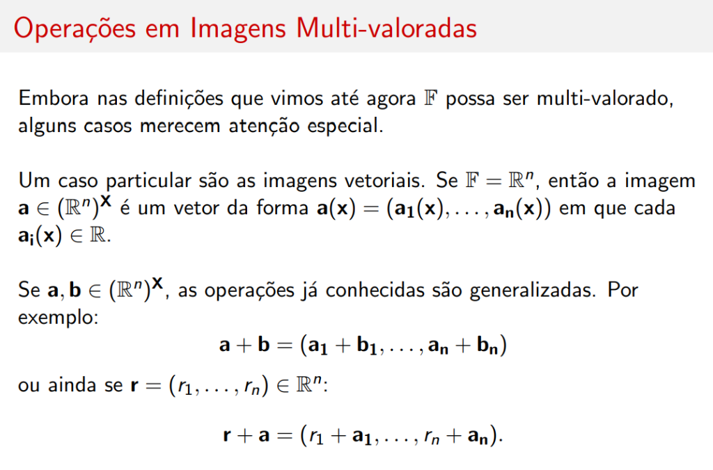
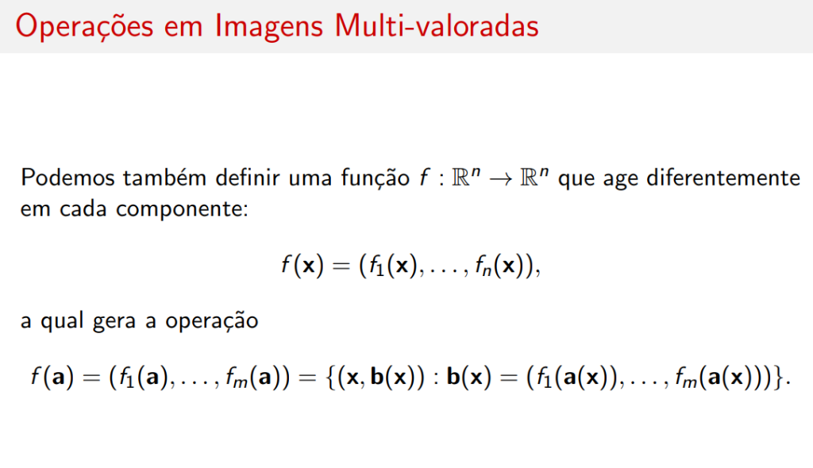
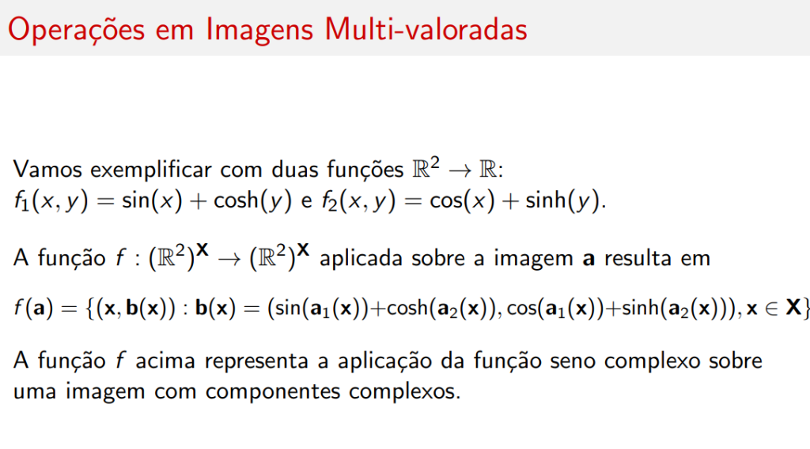
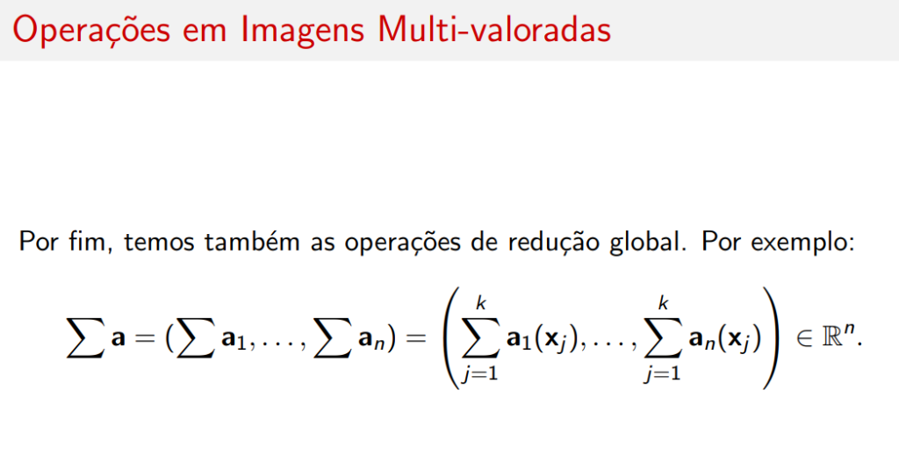

# Operações em Imagens Multi-valoradas

## Introdução

Embora nas definições que vimos até agora \( \mathbb{F} \) possa ser multi-valorado, alguns casos merecem atenção especial.

---

## Imagens Vetoriais

Um caso particular são as **imagens vetoriais**. Se \( \mathbb{F} = \mathbb{R}^n \), então a imagem \( \mathbf{a} \in (\mathbb{R}^n)^{\mathbf{X}} \) é um vetor da forma:

\[
\mathbf{a}(\mathbf{x}) = (\mathbf{a}_1(\mathbf{x}), \ldots, \mathbf{a}_n(\mathbf{x}))
\]

em que cada \( \mathbf{a}_i(\mathbf{x}) \in \mathbb{R} \).

### Operações Generalizadas

Se \( \mathbf{a}, \mathbf{b} \in (\mathbb{R}^n)^{\mathbf{X}} \), as operações já conhecidas são generalizadas. Por exemplo:

\[
\mathbf{a} + \mathbf{b} = (\mathbf{a}_1 + \mathbf{b}_1, \ldots, \mathbf{a}_n + \mathbf{b}_n)
\]

ou ainda se \( \mathbf{r} = (r_1, \ldots, r_n) \in \mathbb{R}^n \):

\[
\mathbf{r} + \mathbf{a} = (r_1 + \mathbf{a}_1, \ldots, r_n + \mathbf{a}_n)
\]

---

## Operações com Sequência de Operações

Outra generalização é substituir a operação binária \( \gamma \) por uma **sequência de operações** \( \gamma_j : \mathbb{R}^n \times \mathbb{R}^n \rightarrow \mathbb{R} \) de modo que:

\[
\mathbf{a} \gamma \mathbf{b} \equiv (\mathbf{a} \gamma_1 \mathbf{b}, \ldots, \mathbf{a} \gamma_n \mathbf{b})
\]

### Exemplo: Imagens Complexo-valoradas

Por exemplo, se \( \gamma_1 \) e \( \gamma_2 \) são duas operações binárias \( \mathbb{R}^2 \times \mathbb{R}^2 \rightarrow \mathbb{R} \) definidas por:

\[
(x_1, x_2) \gamma_1 (y_1, y_2) = x_1 y_1 - x_2 y_2
\]

\[
(x_1, x_2) \gamma_2 (y_1, y_2) = x_1 y_2 + x_2 y_1
\]

Se \( \mathbf{a}, \mathbf{b} \in (\mathbb{R}^2)^{\mathbf{X}} \) são **imagens complexo-valoradas**, o produto ponto-a-ponto \( \mathbf{c} = \mathbf{a} \gamma \mathbf{b} \) é dado por:

\[
\mathbf{c}(\mathbf{x}) = (\mathbf{a}_1(\mathbf{x})\mathbf{b}_1(\mathbf{x}) - \mathbf{a}_2(\mathbf{x})\mathbf{b}_2(\mathbf{x}), \mathbf{a}_1(\mathbf{x})\mathbf{b}_2(\mathbf{x}) + \mathbf{a}_2(\mathbf{x})\mathbf{b}_1(\mathbf{x}))
\]

!!! note "Interpretação"
    Essa é a fórmula do produto de números complexos \( (a + bi)(c + di) = (ac - bd) + (ad + bc)i \).

---

## Máximo e Mínimo na j-ésima Coordenada

Outras duas operações importantes são o **máximo** e **mínimo** na \( j \)-ésima coordenada ("vencedor leva tudo").

Se \( \mathbf{a}, \mathbf{b} \in (\mathbb{R}^n)^{\mathbf{X}} \), o **máximo na j-ésima coordenada** é dado por:

\[
\mathbf{a} \vee |_j \mathbf{b} = \{(\mathbf{x}, \mathbf{c}(\mathbf{x})) : \mathbf{c}(\mathbf{x}) = \mathbf{a}(\mathbf{x}) \text{ se } \mathbf{a}_j(\mathbf{x}) \geq \mathbf{b}_j(\mathbf{x}), \text{ caso contrário } \mathbf{c}(\mathbf{x}) = \mathbf{b}(\mathbf{x})\}
\]

e o **mínimo** por:

\[
\mathbf{a} \wedge |_j \mathbf{b} = \{(\mathbf{x}, \mathbf{c}(\mathbf{x})) : \mathbf{c}(\mathbf{x}) = \mathbf{a}(\mathbf{x}) \text{ se } \mathbf{a}_j(\mathbf{x}) \leq \mathbf{b}_j(\mathbf{x}), \text{ caso contrário } \mathbf{c}(\mathbf{x}) = \mathbf{b}(\mathbf{x})\}
\]

---

## Operações Unárias Induzidas

Operações unárias também podem ser induzidas com funções como antes.

Seja \( f \) uma função \( \mathbb{R}^n \rightarrow \mathbb{R}^n \):

\[
f(x_1, \ldots, x_n) \equiv (f(x_1), \ldots, f(x_n))
\]

Esta função pode gerar então uma **operação unária** sobre a imagem \( \mathbf{a} \in (\mathbb{R}^n)^{\mathbf{X}} \):

\[
f(\mathbf{a}) \equiv f \circ \mathbf{a} = (f(\mathbf{a}_1), \ldots, f(\mathbf{a}_n))
\]

### Exemplo

Como exemplo, a função \( f = \sin : \mathbb{R} \rightarrow \mathbb{R} \) gera:

\[
\sin(\mathbf{a}) = (\sin(\mathbf{a}_1), \ldots, \sin(\mathbf{a}_n))
\]

---

## Funções com Componentes Diferentes

Podemos também definir uma função \( f : \mathbb{R}^n \rightarrow \mathbb{R}^m \) que age diferentemente em cada componente:

\[
f(\mathbf{x}) = (f_1(\mathbf{x}), \ldots, f_m(\mathbf{x}))
\]

a qual gera a operação:

\[
f(\mathbf{a}) = (f_1(\mathbf{a}), \ldots, f_m(\mathbf{a})) = \{(\mathbf{x}, \mathbf{b}(\mathbf{x})) : \mathbf{b}(\mathbf{x}) = (f_1(\mathbf{a}(\mathbf{x})), \ldots, f_m(\mathbf{a}(\mathbf{x})))\}
\]

!!! tip "Aplicação"
    Essa generalização permite transformações de espaço de cores, como conversão RGB → HSV, onde cada componente tem uma fórmula diferente.

---

## Resumo

| Tipo | Notação | Descrição |
|------|---------|-----------|
| **Soma vetorial** | \( \mathbf{a} + \mathbf{b} \) | Soma componente a componente |
| **Produto complexo** | \( \mathbf{a} \gamma \mathbf{b} \) | Produto de números complexos pixel a pixel |
| **Máximo j-ésima** | \( \mathbf{a} \vee \|_j \mathbf{b} \) | Vetor de \( \mathbf{a} \) ou \( \mathbf{b} \) baseado na j-ésima coord. |
| **Mínimo j-ésima** | \( \mathbf{a} \wedge \|_j \mathbf{b} \) | Vetor de \( \mathbf{a} \) ou \( \mathbf{b} \) baseado na j-ésima coord. |
| **Operação unária** | \( f(\mathbf{a}) \) | Função aplicada em cada componente |

---

## Exemplo: Seno Complexo

Vamos exemplificar com duas funções \( \mathbb{R}^2 \rightarrow \mathbb{R} \):

\[
f_1(x, y) = \sin(x) + \cosh(y) \quad \text{e} \quad f_2(x, y) = \cos(x) + \sinh(y)
\]

A função \( f : (\mathbb{R}^2)^{\mathbf{X}} \rightarrow (\mathbb{R}^2)^{\mathbf{X}} \) aplicada sobre a imagem \( \mathbf{a} \) resulta em:

\[
f(\mathbf{a}) = \{(\mathbf{x}, \mathbf{b}(\mathbf{x})) : \mathbf{b}(\mathbf{x}) = (\sin(\mathbf{a}_1(\mathbf{x})) + \cosh(\mathbf{a}_2(\mathbf{x})), \cos(\mathbf{a}_1(\mathbf{x})) + \sinh(\mathbf{a}_2(\mathbf{x}))), \mathbf{x} \in \mathbf{X}\}
\]

!!! info "Interpretação"
    A função \( f \) acima representa a aplicação da **função seno complexo** sobre uma imagem com componentes complexos.

---

## Redução Global Vetorial

Por fim, temos também as **operações de redução global**. Por exemplo:

\[
\sum \mathbf{a} = \left( \sum \mathbf{a}_1, \ldots, \sum \mathbf{a}_n \right) = \left( \sum_{j=1}^{k} \mathbf{a}_1(\mathbf{x}_j), \ldots, \sum_{j=1}^{k} \mathbf{a}_n(\mathbf{x}_j) \right) \in \mathbb{R}^n
\]

!!! tip "Aplicação"
    A redução global vetorial é útil para calcular estatísticas por canal em imagens coloridas, como a soma total de cada componente RGB.

